# Component and Interface Interaction Flow

This is the code-level companion to [Game Logic Flow](game-logic-flow.md). That document follows a game through rules and player-facing phases. This document follows information through the implemented C# types: who creates an object, which interface crosses a boundary, who owns mutable state, which events are published, and where an action is made durable for rollback and replay.

Use the two documents together:

- Start with **Game Logic Flow** to understand *what a player is trying to do*.
- Use this document to understand *which types carry that intent and state to completion*.

The diagrams describe the implemented client and headless Core projects. A future-facing type is explicitly marked **future**; it is not shown as a working production path.

## 1. Reading the diagrams

### 1.1 Direction and notation

| Notation | Meaning |
| --- | --- |
| Solid arrow `-->` | Direct call, data access, construction, or ownership. Read it as “uses” unless the label says otherwise. |
| Dotted arrow `-.->` | Event subscription, interface implementation, or an intentionally indirect relationship. |
| `<<interface>>` | Contract consumed by callers. Production code generally depends on this instead of its concrete implementation. |
| `MatchContext` | Match-scoped parameter object and state boundary. It has no MonoGame dependency. |
| `GameplayState` | Client-scoped coordinator. It owns MonoGame-facing input, UI, rendering, and the match session’s wiring. |
| `GameStateDto` / `GameCommandDto` | Serializable data, never the live authority for a running match. |

### 1.2 Architectural invariants

1. `ChaosWarlords.Core` is headless: it contains entities, rules, commands, managers, DTOs, replay, and deterministic utilities without MonoGame rendering or input dependencies.
2. The client reaches **down** into Core through `MatchContext`; Core never reaches **up** into `GameplayState`, `GameplayView`, or MonoGame types.
3. The player does not mutate a match by clicking a view. Input creates an `IGameCommand`, and `CommandDispatcher` validates, snapshots, executes, and records it.
4. `ActionSystem` owns transient targeting and effect-stack state. `MatchManager` owns card-play/devour orchestration and delegates turn completion to `TurnLifecycleSubsystem`.
5. `IPlayerStateManager` is the central mutation service for player resources, piles, troops, trophies, and VP. Map-specific mutations are coordinated through `IMapManager` and its map collaborators.

## 2. Project, layer, and reference boundaries

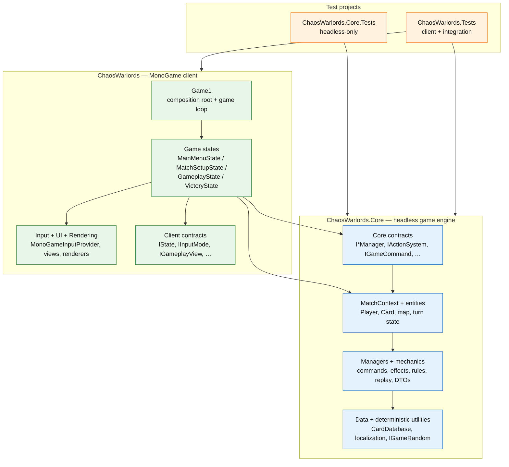

The project reference direction is one-way: the client references Core, while Core does not reference the client. `ChaosWarlords.Core.Tests` verifies that boundary directly by referencing Core alone. The normal test project references the client and can therefore exercise input, UI coordination, and rendering-adjacent behavior as well as Core logic.

## 3. Application and match lifetime

### 3.1 State stack and screen lifetime

`Game1` owns the MonoGame application lifetime. `StateManager` owns a stack of `IState` instances, calls `LoadContent` before pushing or replacing a state, and forwards each update/draw call only to the stack’s current state.

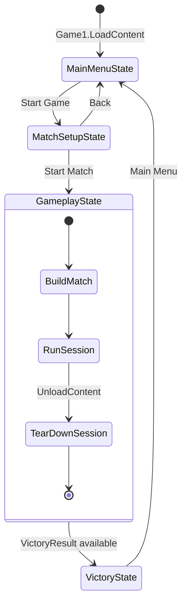

`RuntimeFaultRecovery` sits around `Game1.Update` and `Game1.Draw`. It reports an unhandled frame exception through `ICrashReporter`, lets the reporter use `IReplayManager` to capture replay context, then asks `IStateManager` to replace the active state with a freshly created `MainMenuState`. If recovery itself fails, it logs the second exception and invokes the application exit callback.

### 3.2 Composition order for a playable match

The following sequence matters because `ActionSystem`, `MatchManager`, `MarketStateManager`, and UI wiring have real circular relationships. Core services are constructed first; `GameplayState` connects the late collaborators only after they exist.

```mermaid
sequenceDiagram
    participant G as Game1
    participant SM as StateManager
    participant Setup as MatchSetupState
    participant GS as GameplayState
    participant MF as MatchFactory
    participant WD as WorldData
    participant MC as MatchContext
    participant MM as MatchManager
    participant AS as ActionSystem
    participant UI as UIEventMediator

    G->>SM: PushState(MainMenuState)
    SM->>Setup: ChangeState after Start Game
    Setup->>Setup: Build GameDependencies
    Setup->>SM: ChangeState(GameplayState)
    SM->>GS: LoadContent()
    GS->>MF: Build(replayManager, seed, selection)
    MF->>WD: PlayerStateManager, TurnManager, MarketManager,<br/>MapManager, ActionSystem, RNG, seed
    GS->>MC: new MatchContext(WorldData services)
    GS->>AS: SetMatchContext(MatchContext)
    GS->>MM: new MatchManager(MatchContext, VictoryManager)
    MM->>MC: Set MatchManager property
    GS->>AS: SetMatchManager(MatchManager)
    GS->>AS: SetMarketStateManager(MarketStateManager)
    GS->>UI: new UIEventMediator(...); Initialize()
    GS->>GS: Create input, replay, card-play, and player controllers
```

`MatchFactory.Build` constructs the initial headless graph and returns `WorldData` as a short-lived assembly result. `GameplayState.InitializeMatch` wraps those objects in `MatchContext`, then creates the client-owned collaborators. `WorldData` is not a second runtime context: `MatchContext` is the object shared by the match after initialization.

### 3.3 Lifetime and ownership map

| Owner | Lives for | Owns or creates | Must not own |
| --- | --- | --- | --- |
| `Game1` | Application | graphics device, `StateManager`, `IInputProvider`, `CardDatabase`, `ReplayManager`, logger, fault recovery | Match-specific game state |
| `StateManager` | Application | `Stack<IState>` and state lifecycle calls | Core match managers |
| `MatchSetupState` | Setup screen | market half-deck selection and `GameDependencies` | A running `MatchContext` |
| `GameplayState` | One gameplay screen/session | client coordinators, view, `CommandDispatcher`, `MatchContext` wiring, event subscriptions | Rule implementation inside Core |
| `MatchContext` | One match | match services, context-wide piles, phase/turn/sequence metadata, seeded RNG | MonoGame input, UI, rendering, disk I/O |
| `ActionSystem` | One match | targeting state, pending selections, execution stack facade, effect subsystems | UI widgets or views |
| `TurnContext` | One player turn | played aspects, promotion credits, turn action history | Cross-match data |

## 4. The two contexts: client coordination versus headless match state

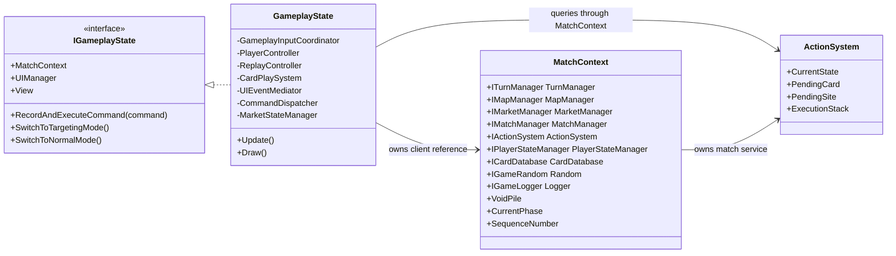

`IGameplayState` is intentionally a client-side contract. Input modes, UI mediation, and controllers use it to request a command dispatch or query UI state without depending on `GameplayState` directly. Core types use `MatchContext` and Core interfaces instead; there is no Core dependency on `IGameplayState`.

`MatchContext` is a scoped parameter object, not a general-purpose service locator. Its constructor receives immutable match services, initializes the match RNG and `CardRuleEngine`, and exposes match-wide data such as the void pile and sequence number. `MatchManager` is assigned after construction because it needs the completed context in its own constructor.

## 5. Headless match composition

### 5.1 MatchContext service graph

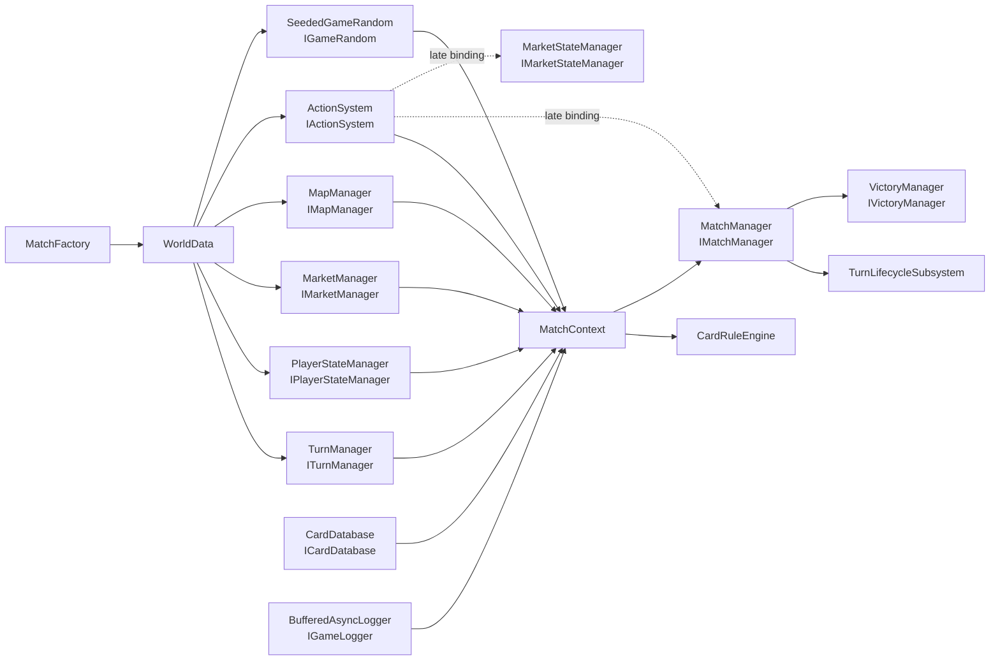

### 5.2 Why the late bindings exist

| Late-bound collaborator | Set by | Why it is not a constructor dependency |
| --- | --- | --- |
| `ActionSystem` → `IMatchManager` | `GameplayState.InitializeMatch` | `MatchManager` requires the completed `MatchContext`, which already contains `ActionSystem`. `DevourSubsystem` and `MapActionSubsystem` receive the same manager through this binding. |
| `ActionSystem` → `IMarketStateManager` | `GameplayState.InitializeSystems` | Market open/browse/devour mode is client presentation state. It is created with the gameplay input/UI system, not by `MatchFactory`. |
| `ActionSystem` → `MatchContext` | `GameplayState.InitializeMatch` | The execution stack needs the context for effect processing, pre-target replay, and targeting snapshots. |
| `MatchContext.MatchManager` | `MatchManager` constructor | `MatchManager` makes itself available to effect application after its turn lifecycle subsystem is complete. |

The first four constructor dependencies of `ActionSystem`—turn, map, player-state, and market services—are regular Core dependencies and are immutable. The three entries above are the narrow cycle-breaking connections.

## 6. Frame update, raw input, and UI events

### 6.1 One gameplay frame

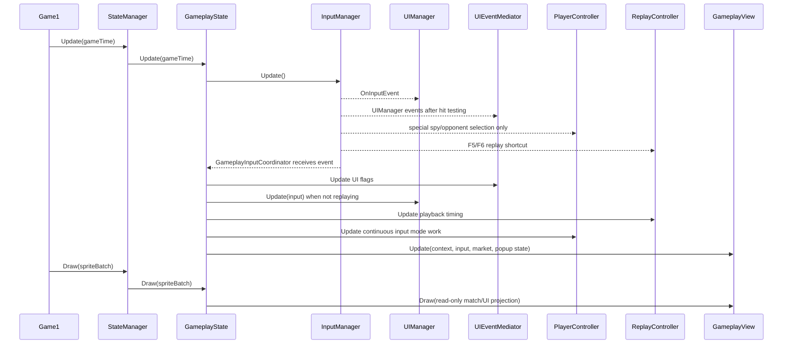

`InputManager` polls `IInputProvider` and emits `OnInputEvent` for left-click, right-click, and newly pressed keys. The event stream has several subscribers, each with a deliberately narrow responsibility:

| Subscriber | Owns | Does not own |
| --- | --- | --- |
| `GameplayInputCoordinator` | popup blocking, active `IInputMode`, command production, universal Escape/Enter fallback | raw device polling, rendering |
| `UIManager` | screen-space button hit testing and UI request events | game-rule validation or match mutation |
| `PlayerController` | the two view-backed selections that need special button geometry: spy color and opponent | normal map/card/cancel routing |
| `ReplayController` | F5 save and F6 load, timed playback loop | normal player command routing |

The coordinator is the single owner of blocking/cancellation routing. `PlayerController` returns immediately while an overlay is open, preventing the same raw event from being processed as both popup input and gameplay input.

### 6.2 Input mode strategy

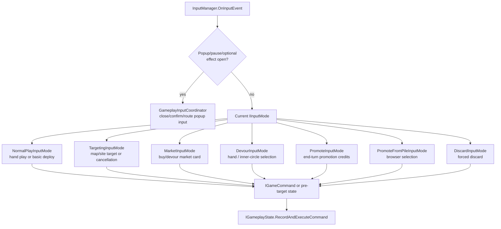

`GameplayInputCoordinator` listens to two state sources to choose a mode:

- `IActionSystem.OnStateChanged` selects a targeting-specific mode when `ActionState` changes.
- `IMarketStateManager.ModeChanged` selects normal market browsing or market target selection.

Each `IInputMode.HandleInteraction` returns an `IGameCommand?`. A null result means that the mode intentionally consumed no mutation; it is common for hover, an invalid target, a pre-commit step, or an unhandled shortcut. `GameplayInputCoordinator` dispatches a non-null command through `IGameplayState.RecordAndExecuteCommand`.

### 6.3 UI request and response flow

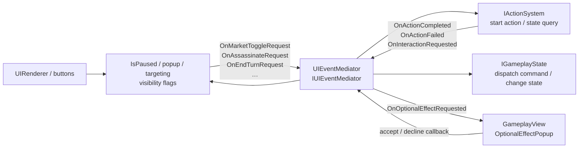

`UIEventMediator` is the client-side boundary between UI events and game actions. It subscribes to `IUIManager` request events and to `IActionSystem` result/interaction events. It never becomes a Core dependency: optional effects travel from Core as an `InteractionRequest`, then the mediator presents it and returns the chosen response callback.

`GameplayView` subscribes to the mediator’s optional-effect event only to create and draw the popup. It does not decide whether an effect is legal; it invokes the supplied accept/decline callback, which resumes the effect stack through the mediator/action system.

## 7. Rendering is a read-side projection

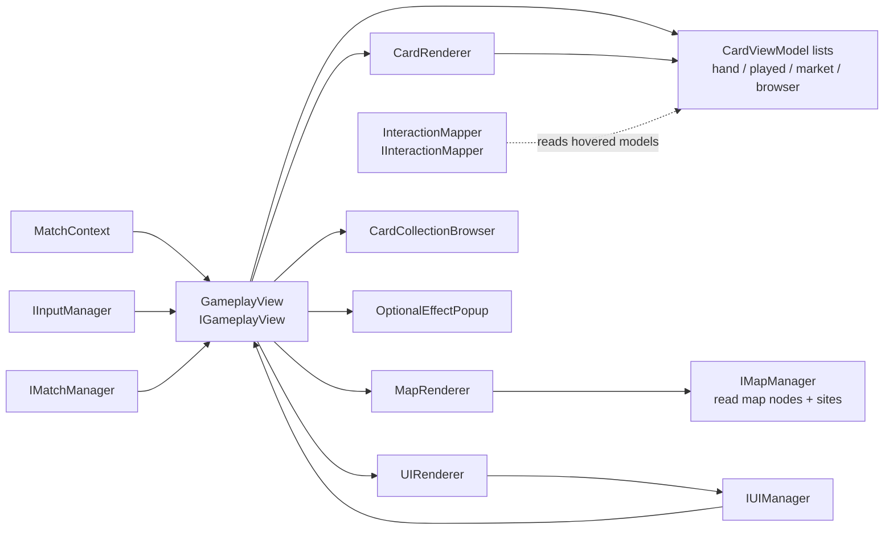

`GameplayState.Draw` passes the current match and UI projection into `IGameplayView`. `GameplayView` creates view models from the current hand, played cards, market, and browser source; `MapRenderer` reads `IMapManager`, while card and UI renderers draw those projections. Rendering must not alter `MatchContext`.

`InteractionMapper` turns hovered view models back into domain objects for input modes. This keeps normal card hit testing aligned with the view model rectangles. Spy-return and opponent-selection button hit testing are the two current exceptions: their screen geometry is also calculated in `InteractionMapper`, so changes to those overlay layouts must update both the view and mapper together.

## 8. Command boundary: intent, validation, transaction, and replay

### 8.1 Command family map

```mermaid
classDiagram
    class IGameCommand {
        <<interface>>
        +Validate(MatchContext) bool
        +Execute(MatchContext)
        +ToDto() GameCommandDto
    }

    class CommandDispatcher {
        <<ICommandDispatcher>>
        +Dispatch(command, context)
    }

    class PlayCardCommand
    class BuyCardCommand
    class DevourCardCommand
    class PlayFromMarketCommand
    class DeployTroopCommand
    class AssassinateCommand
    class SupplantCommand
    class MoveTroopCommand
    class ReturnTroopCommand
    class PlaceSpyCommand
    class ResolveSpyCommand
    class ReturnOwnSpyCommand
    class ReturnAnySpyCommand
    class ReturnSpyToPlaceCommand
    class DeployFromTrophyHallCommand
    class PromoteCommand
    class DiscardCardCommand
    class SelectOpponentCommand
    class DeclineRepeatCommand
    class EndTurnCommand
    class CancelActionCommand
    class ToggleMarketCommand
    class SwitchToNormalModeCommand
    class StartAssassinateCommand
    class StartReturnSpyCommand
    class ActionCompletedCommand

    IGameCommand <|.. PlayCardCommand
    IGameCommand <|.. BuyCardCommand
    IGameCommand <|.. DevourCardCommand
    IGameCommand <|.. PlayFromMarketCommand
    IGameCommand <|.. DeployTroopCommand
    IGameCommand <|.. AssassinateCommand
    IGameCommand <|.. SupplantCommand
    IGameCommand <|.. MoveTroopCommand
    IGameCommand <|.. ReturnTroopCommand
    IGameCommand <|.. PlaceSpyCommand
    IGameCommand <|.. ResolveSpyCommand
    IGameCommand <|.. ReturnOwnSpyCommand
    IGameCommand <|.. ReturnAnySpyCommand
    IGameCommand <|.. ReturnSpyToPlaceCommand
    IGameCommand <|.. DeployFromTrophyHallCommand
    IGameCommand <|.. PromoteCommand
    IGameCommand <|.. DiscardCardCommand
    IGameCommand <|.. SelectOpponentCommand
    IGameCommand <|.. DeclineRepeatCommand
    IGameCommand <|.. EndTurnCommand
    IGameCommand <|.. CancelActionCommand
    IGameCommand <|.. ToggleMarketCommand
    IGameCommand <|.. SwitchToNormalModeCommand
    IGameCommand <|.. StartAssassinateCommand
    IGameCommand <|.. StartReturnSpyCommand
    IGameCommand <|.. ActionCompletedCommand
    CommandDispatcher --> IGameCommand : validates + executes
```

The full command set is deliberately shown above because it is the replayable action vocabulary. It falls into four practical groups:

| Group | Commands | Primary executor |
| --- | --- | --- |
| Card and market | `PlayCard`, `BuyCard`, `DevourCard`, `PlayFromMarket` | `IMatchManager`, `IMarketManager`, `IActionSystem` |
| Map and force movement | `DeployTroop`, `Assassinate`, `Supplant`, `MoveTroop`, `ReturnTroop`, `PlaceSpy`, `ResolveSpy`, `ReturnOwnSpy`, `ReturnAnySpy`, `ReturnSpyToPlace`, `DeployFromTrophyHall` | `IActionSystem` delegates to map/spy subsystems and `IMapManager` |
| Player decisions | `Promote`, `DiscardCard`, `SelectOpponent`, `DeclineRepeat`, `EndTurn` | turn context, action system, or `IMatchManager` |
| Mode and action control | `CancelAction`, `ToggleMarket`, `SwitchToNormalMode`, `StartAssassinate`, `StartReturnSpy`, `ActionCompleted` | `IActionSystem` and client-facing market/action state |

### 8.2 Transaction and recording sequence

```mermaid
sequenceDiagram
    participant Source as Input mode / UI mediator / ActionSystem
    participant GS as GameplayState
    participant CD as CommandDispatcher
    participant DTO as DtoMapper
    participant Cmd as IGameCommand
    participant MC as MatchContext
    participant RM as ReplayManager
    participant SR as StateRestorer

    Source->>GS: RecordAndExecuteCommand(command)
    GS->>CD: Dispatch(command, context)
    CD->>DTO: ToGameStateDto(context)
    DTO-->>CD: complete pre-command snapshot
    CD->>Cmd: Validate(context)
    alt invalid
        Cmd-->>CD: false
        CD-->>GS: log and stop; no mutation or recording
    else valid
        CD->>MC: increment SequenceNumber; capture actor + recording slot
        CD->>Cmd: Execute(context)
        Cmd->>MC: mutate through managers/action system
        CD->>RM: InsertCommand(slot, command, actor, sequence)
    else execute throws
        Cmd-->>CD: exception
        CD->>SR: RestoreState(context, snapshot)
        SR-->>CD: restored or throws rollback failure
        CD-->>GS: rethrow original / aggregate failure
    end
```

`CommandDispatcher` requires a complete `GameStateDto` snapshot before it even validates. This makes a rejected command a no-op and gives an executing command a rollback path if it throws. The sequence number and the replay-recording slot are reserved before `Execute`, which preserves causal order when an executing command synchronously causes a nested dispatch. The current replayable command vocabulary contains 26 concrete `IGameCommand` classes.

There are two narrow direct paths worth knowing when tracing code:

- `CardPlaySystem.PlayCard` is a client helper that calls `IMatchManager.PlayCard` for programmatic/pre-commit flows. Normal player card clicks still produce `PlayCardCommand` through `NormalPlayInputMode`.
- `ReplayController` executes hydrated recorded commands directly during playback rather than using `CommandDispatcher`; it increments `MatchContext.SequenceNumber` itself and intentionally does not re-record the replay stream.

## 9. Card data, rule validation, and effect execution

### 9.1 From authored JSON to a live card

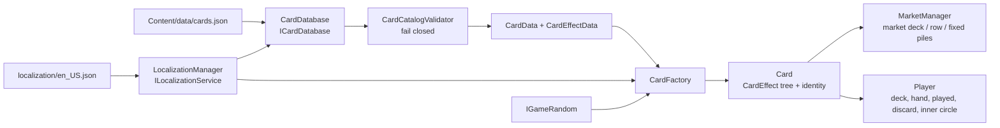

`Game1.LoadContent` loads localization before `CardDatabase`, then loads `cards.json`. `CardDatabase` validates the complete catalog before it mints live cards. `CardFactory` resolves authoring data and localization into a concrete `Card`; the database expands selected market definitions into physical copies using the match RNG.

The important identity split is:

| Identifier | Purpose |
| --- | --- |
| `Card.DefinitionId` | Stable catalog identity, used for card database lookup and most authored references. |
| `Card.Id` | Per-created card identifier used by established command paths. |
| `Card.RuntimeId` | Physical-copy identity used to disambiguate duplicate copies during snapshots and replay hydration. |

### 9.2 Effect pipeline

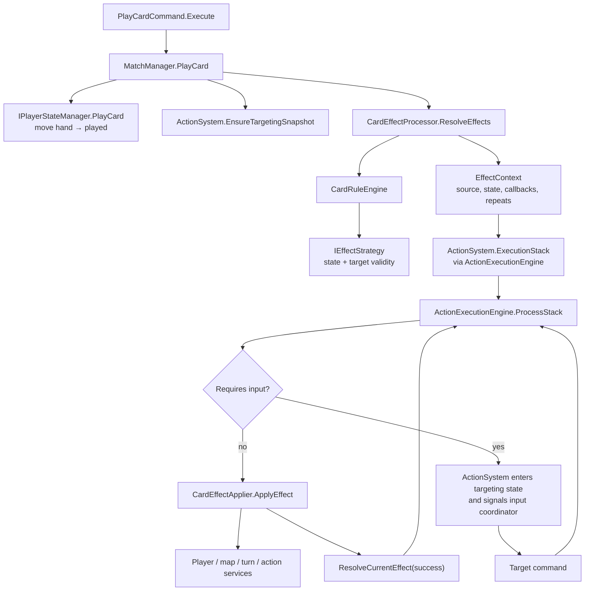

The responsibilities are deliberately separated:

| Type | Decides | Does not decide |
| --- | --- | --- |
| `CardRuleEngine` | which `IEffectStrategy` applies; effect conditions; valid targets | how an automatic effect mutates state |
| `IEffectStrategy` implementations | target existence, targeting `ActionState`, repeat support, temporary selection reset | DTO/replay persistence or rendering |
| `CardEffectProcessor` | which authored effect nodes become `EffectContext` frames; focus filtering; alternatives, successors, repeat expansion, affected actor | the mutation for an effect type |
| `ActionExecutionEngine` | LIFO processing, optional interaction requests, automatic versus input-required execution, repeat continuation, stack completion | public client targeting fields |
| `CardEffectApplier` | how a resolved automatic `EffectType` changes the match or starts a targeting operation | effect-tree construction |
| `ActionSystem` | public targeting state, pending selections, cancellation snapshot, facade methods/events | UI presentation |

### 9.3 Strategy registry

`CardRuleEngine` maps targeting effect types to these `IEffectStrategy` implementations:

| Strategy | Primary decision |
| --- | --- |
| `AssassinateStrategy`, `SupplantStrategy`, `DeployTroopStrategy` | legal troop/node target availability |
| `MoveUnitStrategy` | legal move source/destination and repeat reset |
| `ReturnUnitStrategy`, `ReturnUnitOrSpyStrategy`, `ReturnOwnSpyStrategy`, `ReturnEnemySpyStrategy` | troop/spy eligibility and ownership/presence rules |
| `PlaceSpyStrategy`, `DeployFromTrophyHallStrategy` | eligible site or deployment target |
| `DevourStrategy`, `PlayFromMarketStrategy`, `PromoteFromPileStrategy` | selected card source and browser/market targeting |
| `DiscardStrategy`, `SelectOpponentStrategy` | player/card selection eligibility |
| `DefaultStrategy` | safe non-targeting fallback for effect types with no specialized strategy |

`DevourStrategyFactory` is a separate internal strategy family. It chooses `DevourFromHandStrategy`, `DevourFromMarketStrategy`, `DevourSelfStrategy`, or `DevourFromInnerCircleStrategy` based on a devour effect’s source location.

### 9.4 Optional and chained effects

For a required targeting effect, the execution engine puts the effect on top of the stack and asks `ActionSystem` to enter its targeting state. The input pipeline produces the next command. That command completes the action, which resolves or repeats the top `EffectContext`; a successful context can push its `OnSuccess` successor.

For an optional effect, the execution engine raises `IActionSystem.OnInteractionRequested`. `UIEventMediator` converts the `InteractionRequest` into an optional-effect popup and returns an accept/decline decision through the supplied callback. The UI therefore chooses an already-authored branch; it never evaluates card legality itself.

`ActionSystem.EnsureTargetingSnapshot` captures one `GameStateDto` at the beginning of a targeting sequence. `CancelTargeting` restores that snapshot through `StateRestorer`, clears or restores the relevant action state, and returns a pending played card to the hand by physical `RuntimeId` when necessary. A deliberate “decline remaining repeats” or optional promotion forfeit is different: it keeps already resolved progress and resolves the current effect instead of reverting the whole sequence.

## 10. ActionSystem and map-action collaboration

### 10.1 ActionSystem composition

```mermaid
classDiagram
    direction LR

    class IActionSystem {
        <<interface>>
        +CurrentState
        +StartTargeting()
        +HandleTargetClick()
        +CompleteAction()
        +CancelTargeting()
        +ExecutionStack
    }

    class ActionSystem {
        -DevourSubsystem
        -SpySubsystem
        -MapActionSubsystem
        -ActionInputController
        -PreTargetHandler
        -ActionExecutionEngine
        +OnStateChanged
        +OnActionCompleted
        +OnInteractionRequested
        +OnAutoExecuteCommand
    }

    class ActionExecutionEngine {
        <<internal>>
        +PushEffect()
        +ProcessStack()
        +ResolveCurrentEffect()
    }

    class ActionInputController {
        +HandleTargetClick()
    }

    class DevourSubsystem {
        <<IDevourSubsystem>>
    }

    class SpySubsystem {
        <<ISpySubsystem>>
    }

    class MapActionSubsystem {
        <<IMapActionSubsystem>>
    }

    class PreTargetHandler {
        <<internal>>
        +TryExecutePreTarget()
    }

    IActionSystem <|.. ActionSystem
    ActionSystem *-- ActionExecutionEngine
    ActionSystem *-- ActionInputController
    ActionSystem *-- DevourSubsystem
    ActionSystem *-- SpySubsystem
    ActionSystem *-- MapActionSubsystem
    ActionSystem *-- PreTargetHandler
    ActionExecutionEngine -. callback through IActionSystem .-> IActionSystem
    SpySubsystem -. callback through IActionSystem .-> IActionSystem
    MapActionSubsystem -. callback through IActionSystem .-> IActionSystem
    ActionInputController --> ISpySubsystem
```

`ActionSystem` is the stable public facade. The internal execution engine owns the LIFO `ExecutionStack`; the facade re-raises its completion, interaction, and auto-execute events. The specialized subsystems receive `IActionSystem` rather than the concrete class so they can request state transitions and completion without owning the coordinator.

| Collaborator | Responsibility | Key outgoing interaction |
| --- | --- | --- |
| `ActionInputController` | Converts map/site click results for the current `ActionState` into a concrete command | creates map/spy/deploy commands, delegates spy-specific cases |
| `ActionExecutionEngine` | Drives `EffectContext` frames through automatic, optional, required-input, and repeat paths | calls back to `IActionSystem` and publishes auto commands/interactions |
| `DevourSubsystem` | Hand, market, inner-circle, deferred, and pre-target devour selection | uses `IMatchManager` and client `IMarketStateManager` after late binding |
| `SpySubsystem` | Place, return-own, return-enemy, and choose-among-spies flow | creates spy commands, then calls `IMapManager` through action completion |
| `MapActionSubsystem` | Assassinate, supplant, return, deploy, trophy-hall deploy, and movement execution | calls `IMapManager`, `IPlayerStateManager`, `IMatchManager`, then completes stack work |
| `PreTargetHandler` | Consumes targets selected before a card is committed so replay and pre-commit flows can resolve them once | emits auto commands through `OnAutoExecuteCommand` |

### 10.2 Map manager as a facade

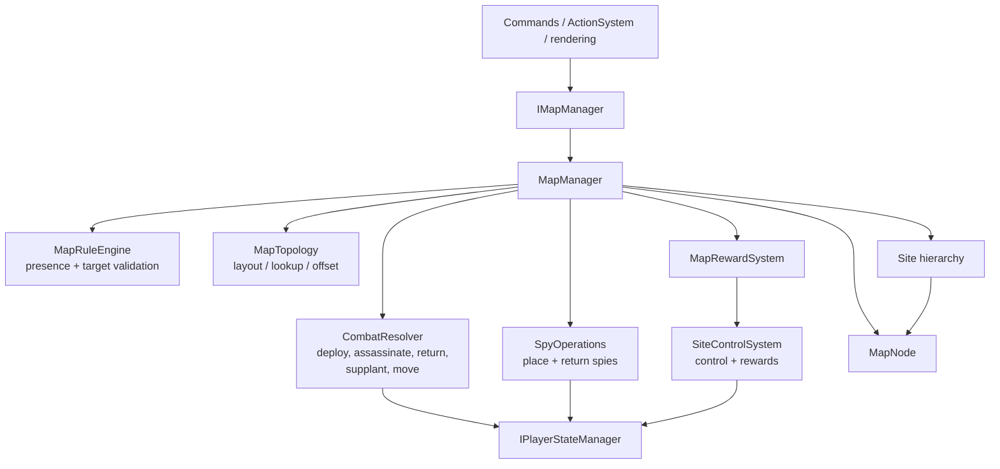

`MapManager` owns the live node/site collections and is the public map facade. It composes the focused map collaborators rather than exposing their internals to callers.

| Entity or service | Owns or changes |
| --- | --- |
| `MapNode` | a troop-space position, occupant color, and neighbor relations |
| `Site` → `CitySite` / `NonCitySite` → `StartingSite` | grouped nodes, spies, owner, control state, bounds, scoring/reward data |
| `Route` | a route relation between sites |
| `MapRuleEngine` | presence and legal target rules |
| `CombatResolver` | node-occupant mutations for deploy, assassinate, return, supplant, and move; delegates player counters/trophies/VP to `IPlayerStateManager` |
| `SpyOperations` | spy placement/removal and site recalculation |
| `SiteControlSystem` | control/total-control recalculation and start-of-turn site rewards |
| `MapTopology` / `MapLayoutEngine` | topology and deterministic layout calculations |
| `MapFactory` | initial scenario-map construction used by `MatchFactory` |

### 10.3 Place-spy's return-then-place sub-flow

Rulebook p.12 permits a player whose barracks are empty to return one of their own spies before placing it. `SpySubsystem.HandlePlaceSpy` resolves the same site-click input from live state: with a spy in barracks it creates `PlaceSpyCommand`; with none, a click on the active player's existing spy creates `ReturnSpyToPlaceCommand` instead.

```mermaid
sequenceDiagram
    participant Click as TargetingPlaceSpy site click
    participant SS as SpySubsystem
    participant Return as ReturnSpyToPlaceCommand
    participant Map as IMapManager
    participant AS as IActionSystem
    participant Place as PlaceSpyCommand

    Click->>SS: HandlePlaceSpy(site, cardId)
    alt barracks has a spy
        SS-->>Place: new PlaceSpyCommand(site, cardId)
        Place->>Map: PlaceSpy(site, active player)
        Place->>AS: SetPendingSiteForChain + CompleteAction
    else barracks empty; clicked own spy
        SS-->>Return: new ReturnSpyToPlaceCommand(site, cardId)
        Return->>Map: CanReturnOwnSpy + ReturnOwnSpy
        Return-->>AS: do not complete; remain TargetingPlaceSpy
        Note over AS: barracks now has one spy; next legal click creates PlaceSpyCommand
    else barracks empty; not own spy
        SS-->>Click: no command / no mutation
    end
```

`ReturnSpyToPlaceCommand` is intentionally the return half only: it validates that `TargetingPlaceSpy` is active, the barracks is still empty, and the selected site contains the active player's spy. It never calls `CompleteAction`, so the original Place Spy effect remains open for the immediately following placement. This differs from `ReturnOwnSpyCommand`, which resolves a separate card-driven `ReturnOwnSpy` targeting effect and can advance a chained action.

## 11. Player, market, and turn state ownership

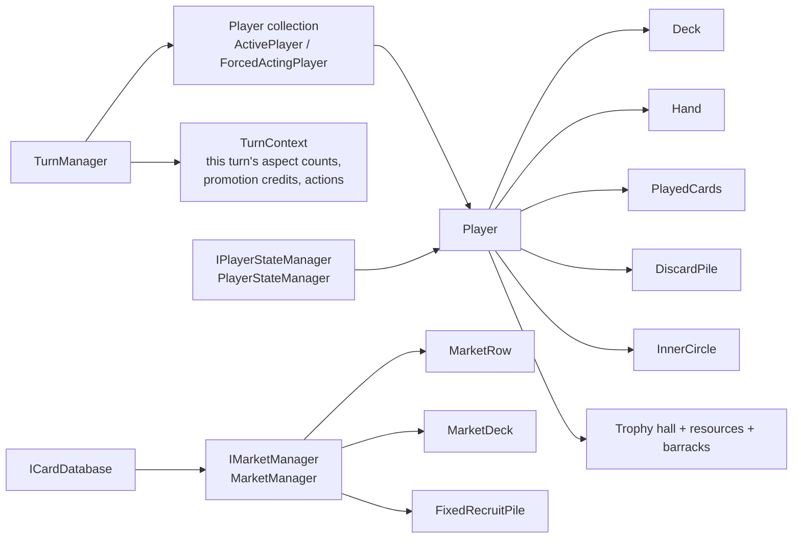

| State | Authoritative owner | Common mutators/readers |
| --- | --- | --- |
| Player hand, deck, discard, played cards, inner circle, resources, VP, barracks, trophy hall | `Player` data, changed through `IPlayerStateManager` | `MatchManager`, `TurnLifecycleSubsystem`, `MarketManager`, map/effect services |
| Active player and temporary forced actor | `ITurnManager` / `TurnManager` | `MatchContext.ActivePlayer`, effect processor, forced-discard lifecycle |
| Per-turn aspect history, promotions, deferred completion effects | `TurnContext` | `TurnManager`, `CardEffectApplier`, promotion input/commands, turn lifecycle |
| Market row, draw deck, fixed recruit piles | `IMarketManager` / `MarketManager` | `CardDatabase` supplies cards; `BuyCardCommand`, devour, and play-from-market paths mutate it |
| Devoured cards and end-turn markers | `MatchContext` | `IMatchManager`, `CardEffectApplier`, `TurnLifecycleSubsystem` |
| Targeting stack and pending selections | `IActionSystem` / `ActionSystem` | input modes, action commands, effect engine, DTO mapper/restorer |

`MarketStateManager` is intentionally absent from the table because it does not own market cards. It owns the client-side market panel mode (`Closed`, browsing, or a target-selection mode) and publishes `ModeChanged` for `GameplayInputCoordinator`.

## 12. End-turn, forced discard, and victory flow

```mermaid
sequenceDiagram
    participant End as EndTurnCommand
    participant MM as MatchManager
    participant TL as TurnLifecycleSubsystem
    participant PSM as PlayerStateManager
    participant AS as ActionSystem
    participant TM as TurnManager
    participant Map as MapManager
    participant VM as VictoryManager
    participant GS as GameplayState

    End->>MM: EndTurn()
    MM->>TL: EndTurn()
    TL->>PSM: resolve turn-end cards; clean up active player; draw hand
    alt opponents owe discard(s)
        TL->>AS: StartTargeting(TargetingDiscard)
        AS-->>TL: each DiscardCardCommand resolves
        TL->>TL: drain queue in seat order
    end
    TL->>TM: EndTurn() / create next TurnContext
    TL->>Map: DistributeStartOfTurnRewards(new active player)
    TL->>VM: CheckEndGameConditions(context)
    alt end condition pending at round end
        TL->>VM: Determine winners / score breakdown
        TL-->>MM: VictoryDto
        MM-->>GS: VictoryResult
        GS->>GS: ChangeState(VictoryState)
    end
```

`MatchManager` exposes the public `IMatchManager` contract but delegates all end-turn, deferred victory, and opponent-discard sequencing to `TurnLifecycleSubsystem`. The lifecycle owns the forced-discard queue; `TurnManager.ForcedActingPlayer` temporarily changes `MatchContext.ActivePlayer` while a queued opponent chooses their discard. The queue is deliberately separate from `TurnContext`, whose active player remains the actual turn owner.

`VictoryManager` calculates a `ScoreBreakdownDto` and determines every player tied for the top score. `DtoMapper.ToVictoryDto` packages the result for `VictoryState` and `VictoryView`; views display the DTO and do not recalculate scores.

## 13. Rollback, serialization, and replay

### 13.1 Snapshot boundary

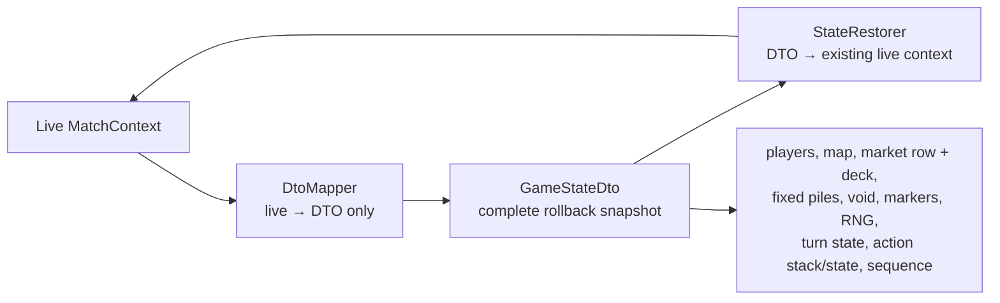

`DtoMapper` is intentionally one-directional for runtime state: it produces DTOs. `StateRestorer` is the inverse for rollback and mutates the existing match graph in place. The restorer resolves cards through `ICardDatabase`, restores physical `RuntimeId` values, rebinds pending references, restores deterministic RNG and turn state, and reconstitutes the action stack’s serializable shape.

The snapshot boundary is used in two places:

- `CommandDispatcher` requires a snapshot before every dispatched command and restores it after an execution failure.
- `ActionSystem` takes one snapshot at the start of a targeting sequence so cancellation can revert the whole sequence rather than only clearing UI fields.

### 13.2 Replay recording and playback

```mermaid
flowchart LR
    Cmd["IGameCommand"] --> ToDto["command.ToDto + DtoMapper\nactor seat + sequence"]
    ToDto --> RM["ReplayManager\nordered GameCommandDto list"]
    RM --> JSON["ReplayDataDto JSON\nseed + market selection + commands"]

    JSON --> RC["ReplayController\nF6 load / timed loop"]
    RC --> RM2["ReplayManager.StartReplay"]
    RM2 --> Hydrate["CommandHydrator\nGameCommandDto → IGameCommand"]
    Hydrate --> Execute["command.Execute(MatchContext)\nreplay path increments sequence"]
```

The replay records commands, not rendered frames. `ReplayDataDto` carries the initial seed, selected market half-decks, and ordered command DTOs. `CommandHydrator` is the reverse command translator; unlike `DtoMapper`, it creates live `IGameCommand` instances from DTOs using the replayed `MatchContext` to resolve cards, nodes, sites, and players.

Playback intentionally bypasses validation and recording because it is reproducing an already recorded sequence. Hydration failure is logged and that command is skipped; this is a replay-corruption concern, not a normal gameplay validation path.

### 13.3 Determinism and the current hash boundary

`IGameRandom` is implemented by `SeededGameRandom`, backed by `Pcg32`. Match setup, deck/card copy construction where needed, shuffles, and draw-dependent operations must use the match RNG so replay starts from the same state.

`MatchContext.GetStateHash()` currently mixes sequence/turn/phase/seed, active player, node occupants, selected player counters, market-row definition IDs, and fixed-pile counts. It is useful as a diagnostic signal, but it is not yet a complete networking-grade state proof: it does not cover every live field such as all pile contents/order, all site/spy state, the action stack, or RNG state. A `GameStateDto` snapshot is broader than this hash and remains the rollback mechanism.

## 14. Failure containment and logging

```mermaid
flowchart TD
    Frame["Game1.Update / Draw"] --> Try["try current StateManager call"]
    Try -->|success| Continue["next MonoGame frame"]
    Try -->|exception| Recovery["RuntimeFaultRecovery"]
    Recovery --> Reporter["ICrashReporter\nCrashReporter"]
    Reporter --> Replay["IReplayManager\nreplay context for crash report"]
    Recovery --> Menu["IStateManager.ChangeState\nfresh MainMenuState"]
    Recovery -->|recovery fails| Exit["log and exit callback"]
```

`IGameLogger` is implemented by `BufferedAsyncLogger`; Core managers accept the logging contract rather than a console/file implementation. `ICrashReporter` is a separate reporting contract used only by runtime fault recovery. Command rollback is not a replacement for frame-level recovery: rollback protects a command transaction, while recovery contains an exception that escaped any frame participant.

## 15. Public contract and implementation catalogue

This catalogue groups the public contracts and concrete types by the boundary they serve. It is intentionally a navigation index rather than a duplicate API reference; follow the linked folders for method signatures.

### 15.1 Core data and infrastructure contracts

| Contract | Production implementation | Interaction role |
| --- | --- | --- |
| `ICardDatabase` | `CardDatabase` | Loads/validates card definitions and mints live cards, market copies, and fixed piles. |
| `ILocalizationService` | `LocalizationManager` | Resolves card names/descriptions while `CardFactory` creates cards. |
| `IDto<TEntity>` | entity DTOs such as `CardDto`, `PlayerDto`, `MapNodeDto`, `SiteDto` | Entity-specific DTO shape; `DtoMapper` coordinates aggregate snapshots. |
| `IGameRandom` | `SeededGameRandom` | Deterministic randomness; captures/restores `GameRandomStateDto`. |
| `IGameLogger` | `BufferedAsyncLogger` | Logging boundary used by Core and client coordinators. |
| `ICrashReporter` | `CrashReporter` | Captures a fault/replay context for application recovery. |
| `IReplayManager` | `ReplayManager` | Command recording, JSON serialization, replay queue, seed/market-selection state. |
| `ICommandDispatcher` | `CommandDispatcher` | Snapshot, validate, execute, record, and rollback a normal command. |
| `INetworkProvider` | **No implementation currently** | Future transport abstraction only; it is not in the current dispatch or gameplay path. |

### 15.2 Core match and mechanics contracts

| Contract | Production implementation | Interaction role |
| --- | --- | --- |
| `ITurnManager` | `TurnManager` | Player order, active/forced actor, per-turn context, turn transition. |
| `IPlayerStateManager` | `PlayerStateManager` | Player resource/card/troop/trophy/VP mutation boundary. |
| `IMarketManager` | `MarketManager` | Market deck, row, fixed piles, recruit and refill operations. |
| `IMapManager` | `MapManager` | Map queries and mutations through map collaborators. |
| `IMatchManager` | `MatchManager` | Card-play/devour orchestration and public turn lifecycle facade. |
| `IVictoryManager` | `VictoryManager` | End-game condition, score breakdown, and winner calculation. |
| `IActionSystem` | `ActionSystem` | Targeting state machine and effect-stack facade. |
| `IGameCommand` | 26 command classes listed in section 8 | Authoritative action vocabulary for dispatch and replay. |
| `IEffectStrategy` | effect strategies listed in section 9 | Rules validation and target-state selection per targeting effect. |
| `IDevourSubsystem` | `DevourSubsystem` | Devour selection and deferred devour state. |
| `ISpySubsystem` | `SpySubsystem` | Spy-selection command creation and execution coordination. |
| `IMapActionSubsystem` | `MapActionSubsystem` | Map-action execution coordination. |

### 15.3 Client contracts

| Contract | Production implementation | Interaction role |
| --- | --- | --- |
| `IGameDependencies` | `GameDependencies` | Immutable hand-off from setup/client composition to `GameplayState`. |
| `IStateManager` | `StateManager` | State-stack lifetime and update/draw delegation. |
| `IState` / `IDrawableState` | menu, setup, gameplay, and victory states | Lifecycle contract; drawable states add `Draw`. |
| `IGameplayState` | `GameplayState` | Client state/query/command contract for input/UI collaborators. |
| `IInputProvider` | `MonoGameInputProvider` | Raw MonoGame keyboard/mouse polling. |
| `IInputManager` | `InputManager` | Edge detection and shared input event publication. |
| `IGameplayInputCoordinator` | `GameplayInputCoordinator` | Blocking checks and current input-mode selection. |
| `IInputMode` | normal, targeting, market, devour, discard, promote, promote-from-pile modes | Converts a context-aware interaction into a command or no-op. |
| `IInteractionMapper` | `InteractionMapper` | Resolves hovered/clicked view projections to domain selections. |
| `IUIManager` | `UIManager` | Button state, hit testing, and UI request events. |
| `IUIEventMediator` | `UIEventMediator` | UI/event bridge for overlays, actions, and optional effects. |
| `IButtonManager` | `ButtonManager` | Buttons used by menu, setup, and victory views. |
| `IGameplayView` | `GameplayView` | Gameplay rendering, view models, optional popup interaction. |
| `IMainMenuView` | `MainMenuView` | Menu and setup screen rendering. |
| `IVictoryView` | `VictoryView` | Final score/winner presentation. |

### 15.4 Concrete types with no separate public contract

| Area | Types and their place in the graph |
| --- | --- |
| Match assembly | `MatchFactory`, `WorldData`, `MapFactory`, `CardFactory`, `MarketDeckSelection` build a legal initial graph. |
| Turn lifecycle | `TurnLifecycleSubsystem` is private to `MatchManager`; callers stay on `IMatchManager`. |
| Map internals | `MapRuleEngine`, `MapTopology`, `CombatResolver`, `SpyOperations`, `MapRewardSystem`, `SiteControlSystem`, `MapLayoutEngine` are composed by `MapManager` or map construction. |
| Action internals | `ActionExecutionEngine`, `ActionInputController`, `PreTargetHandler`, and the three action subsystems are composed by `ActionSystem`. |
| Effect internals | `CardEffectProcessor`, `CardEffectApplier`, `DevourStrategyFactory`, `DynamicAmountResolver`, `EffectTreeSearch`, `TargetingStateEngine`, and `TrophyHallRuleEngine` serve the effect pipeline. |
| Domain entities | `Player`, `Deck`, `Card`, `CardEffect`, `EffectCondition`, `FixedRecruitPile`, `MapNode`, `Site`, `CitySite`, `NonCitySite`, `StartingSite`, and `Route` hold live domain state. |
| Context records | `EffectContext`, `InteractionRequest`, `TurnContext`, `ExecutedAction`, and `MarketDeckSelection` carry match/turn/effect information. |
| DTO aggregates | `GameStateDto`, `ReplayDataDto`, `GameCommandDto` subclasses, card/player/map DTOs, effect/turn/RNG state DTOs, `VictoryDto`, and `ScoreBreakdownDto` cross serialization boundaries. |
| Rendering | `MapRenderer`, `CardRenderer`, `UIRenderer`, `ButtonRenderer`, `CardCollectionBrowser`, `OptionalEffectPopup`, `Popup`, `PopupBuilder`, `SimpleButton`, and `CardViewModel` turn read-side state into MonoGame draw calls. |
| Utilities | `Pcg32`, `StateHasher`, `ObjectPool<T>`, `PooledRectangle`, `PooledVector2`, `LogicVector2`, `LogicRectangle`, `MapGeometry`, and `TextCache` support deterministic, allocation-conscious work without becoming gameplay owners. |

## 16. Trace recipes

When investigating a behavior, follow the smallest relevant path instead of reading the whole graph at once.

| Question | Follow these types in order |
| --- | --- |
| “Why did this button do that?” | `UIManager` → `UIEventMediator` → `GameplayState.RecordAndExecuteCommand` → command → manager/action system |
| “Why did this click target that card/node?” | `InputManager` → `GameplayInputCoordinator` → active `IInputMode` → `InteractionMapper`/`IMapManager` → command |
| “Why is this card asking for input?” | `PlayCardCommand` → `MatchManager.PlayCard` → `CardEffectProcessor` → `CardRuleEngine`/strategy → `ActionExecutionEngine` → `ActionSystem.CurrentState` |
| “Who actually changes a troop, resource, or card pile?” | command → `MapActionSubsystem`/`IMatchManager`/`IMarketManager` → `IMapManager` or `IPlayerStateManager` → entity |
| “Why did cancellation undo multiple changes?” | `ActionSystem.EnsureTargetingSnapshot` → `CancelTargeting` → `StateRestorer.RestoreState` |
| “Why is the replay different or missing an action?” | `CommandDispatcher` → `ReplayManager.InsertCommand` → `GameCommandDto` → `CommandHydrator` → `ReplayController` direct execution |
| “Why did the game return to the menu after an error?” | `Game1.Update`/`Draw` → `RuntimeFaultRecovery` → `CrashReporter`/`ReplayManager` → `StateManager.ChangeState` |

## 17. Related documentation and source entry points

- [Game Logic Flow](game-logic-flow.md) — player/rule-flow diagrams.
- [Architecture Guide](architecture.md) — project organization and design principles.
- [Coding Guidelines](coding-guidelines.md) — mandatory dependency, mutation, determinism, and rendering rules.
- [Testing Guide](testing.md) — unit, integration, and scenario-test organization.
- [MatchContext](../ChaosWarlords.Core/Source/Core/Contexts/MatchContext.cs), [MatchFactory](../ChaosWarlords.Core/Source/Factories/MatchFactory.cs), and [GameplayState](../ChaosWarlords/Source/GameStates/GameplayState.cs) — best starting points for the composition/lifetime diagrams.
- [CommandDispatcher](../ChaosWarlords.Core/Source/Managers/CommandDispatcher.cs), [ActionSystem](../ChaosWarlords.Core/Source/Mechanics/Actions/ActionSystem.cs), [CardEffectProcessor](../ChaosWarlords.Core/Source/Mechanics/Rules/CardEffectProcessor.cs), and [TurnLifecycleSubsystem](../ChaosWarlords.Core/Source/Managers/TurnLifecycleSubsystem.cs) — best starting points for a live action trace.
