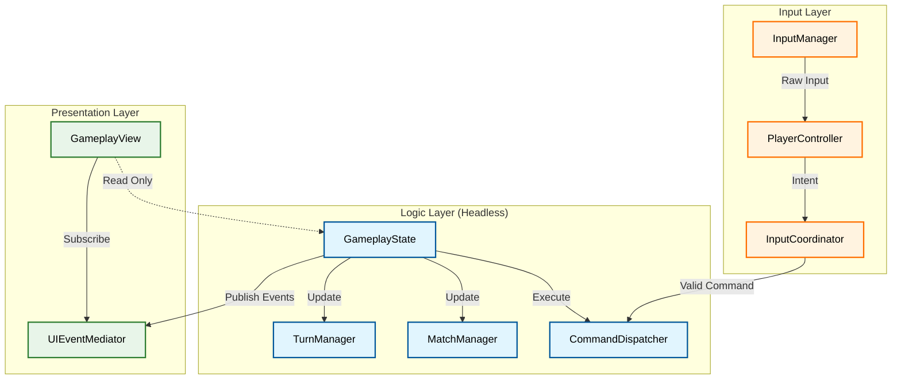
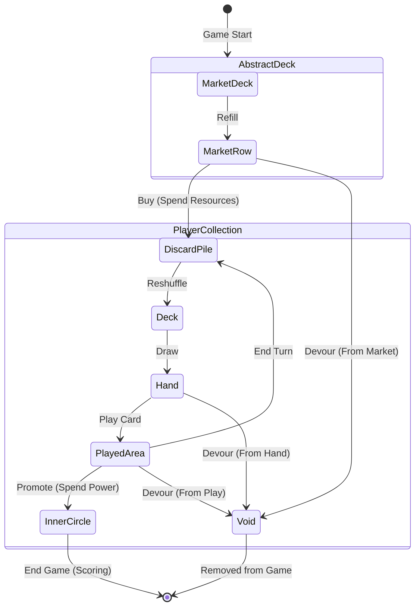
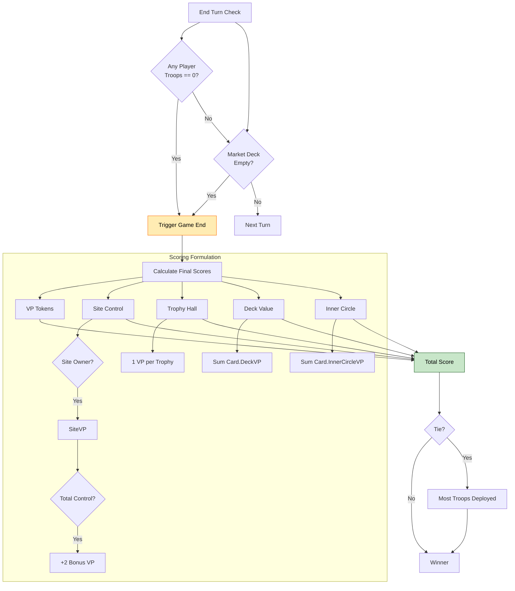
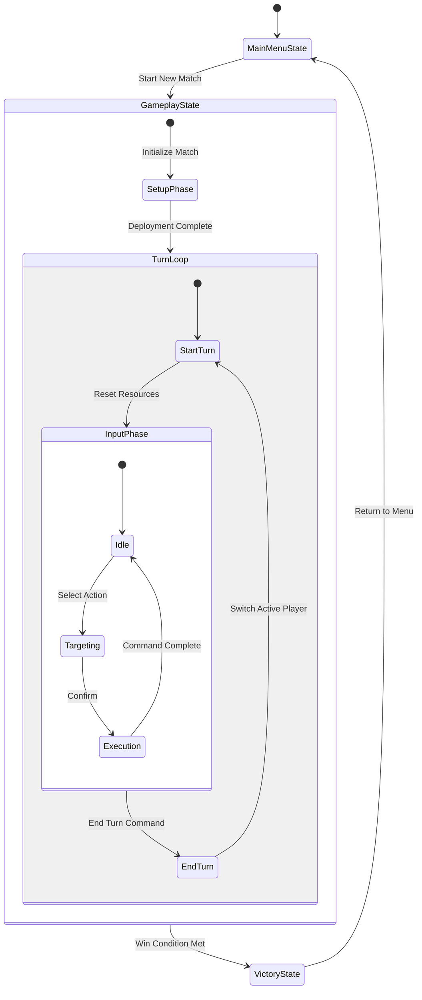
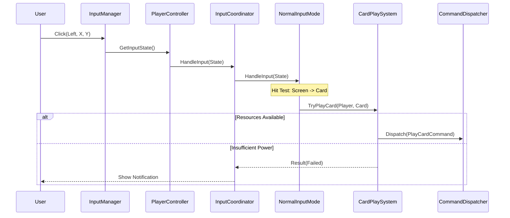
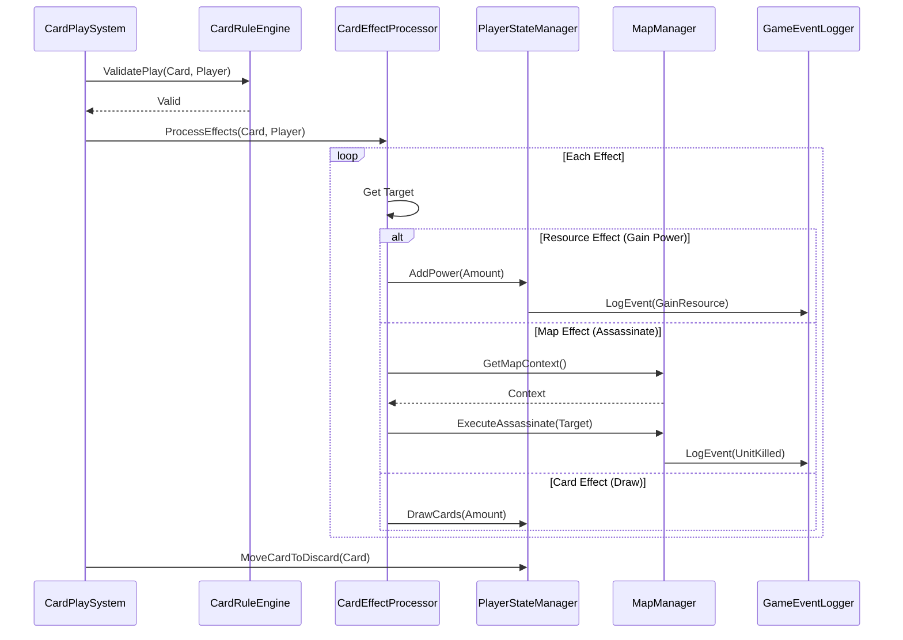
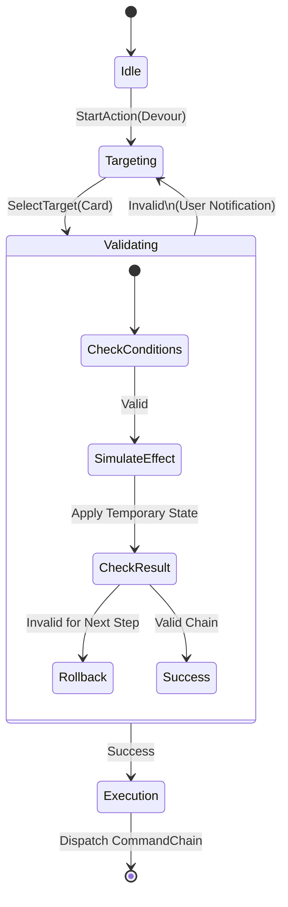
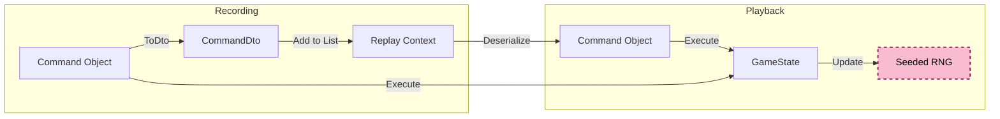

# Game Logic Flow Visualization

This document visualizes the data flow and component interactions within the ChaosWarlords engine, ordered from high-level concepts to detailed implementation flows.

## 1. High-Level Architecture
**Concept**: The 10,000ft view. How the Headless Logic interacts with the Input and View layers.



> **Key Takeaway**: The **Logic Layer** runs the game physics/rules and can run without a screen (Headless). The **Presentation Layer** just listens and draws. The **Input Layer** converts your mouse clicks into "Intents" which are validated before becoming Commands.

---

## 2. Data Lifecycles
**Concept**: Before understanding *how* things happen, understand *what* is being manipulated (Cards & Victory Points).

### 2.1 Card Lifecycle
A card's journey from the Market through a player's hand and eventually to their scoring pile.



> **Key Takeaway**: Cards flow from the **Market** to your **Hand**. When played, they go to your **Played Area**. At the end of the turn, they are **Discarded**. You can only **Promote** cards from the Played Area to your Inner Circle (Score Pile). Devouring a card removes it from the game permanently (Void).

### 2.2 Victory & Scoring Flows
The ultimate goal of the game: how the winner is decided.



> **Key Takeaway**: The game ends if the **Market Deck is empty** OR if **any player runs out of Troops**. Final score is a sum of direct VPs, Site Control (with bonuses), Trophies, Deck Value, and Inner Circle Value. **Ties** are broken by "Most Troops Deployed" (aggressive play wins ties).

---

## 3. Game State & Turn Lifecycle
**Concept**: The "Pulse" of the game. How the application moves between states and how a single turn is structured.



> **Key Takeaway**: The game loops through **Turns**. In each turn, a player enters an **Input Phase** where they can perform multiple actions (Idle -> Target -> Execute) until they explicitly choose to **End Turn**. **Setup Phase** happens once at the start.

---

## 4. Input Processing Pipeline
**Concept**: How a user interacts with the running loop. From "Click" to "Command".



> **Key Takeaway**: Inputs are filtered three times: 
> 1. **InputManager**: "Did they click?" 
> 2. **Coordinator**: "Is this a valid UI state?"
> 3. **InputMode**: "Is the target valid?" 
> Only then is a **Command** dispatched.

---

## 5. Detailed Systems Interaction
**Concept**: The specific mechanics that run when a command is executed.

### 5.1 Card Effect Resolution
This sequence details how a card's effects are processed after it is played.



> **Key Takeaway**: Playing a card triggers a chain of events. The **CardRuleEngine** first validates the play. Then, the **Processor** iterates through every effect on the card. Each effect (Resource, Map, Draw) is handled by a specific Manager.

### 5.2 Troop Deployment Validation
The `MapRuleEngine` ensures all deployments follow graph connectivity and occupancy rules.


> **Key Takeaway**: You can't just put troops anywhere. The **MapRuleEngine** enforces specific rules: You must have troops available, the node must be empty, it must be adjacent to your site, AND within range. All checks must pass.

### 5.3 Combat & Spy Operations (Assassination)
This flow shows the interaction between the Command, MapManager, and CombatResolver.

```mermaid
sequenceDiagram
    participant Command as PerformAssassinateCommand
    participant MapMgr as MapManager
    participant Combat as CombatResolver
    participant SpyOps as SpyOperations
    participant SiteSys as SiteControlSystem

    Command->>MapMgr: Assassinate(Node, Attacker)
    MapMgr->>Combat: CanAssassinate(Node, Attacker)
    
    rect rgb(30, 30, 30)
        Note over Combat: Validation Logic
        Combat->>SpyOps: GetSpiesAtLocation(Node)
        SpyOps-->>Combat: SpyCount
        
        alt Has Spy || Adjacent Unit
            Combat-->>MapMgr: True
        else No Presence
            Combat-->>MapMgr: False
        end
    end

    MapMgr->>Combat: ExecuteAssassinate(Node)
    Combat->>MapMgr: RemoveUnit(Node)
    Combat->>SpyOps: RemoveSpy(Node, Attacker) -- If Spy used
    
    Note right of Combat: Unit Removed
    
    MapMgr->>SiteSys: UpdateControl(Node.Site)
    SiteSys->>SiteSys: Recalculate Ownership
```



> **Key Takeaway**: Assassination is complex. It checks for Spies and adjacent units. If a Spy is present at the target location, it can enable the kill! **SpyOperations** handles this check essentially acting as a "buff" to your assassination attempt.

---

## 6. Transactional Action Flow
**Concept**: Advanced Topic. How complex, multi-step actions (like Devour) affect the game state attomically using "Lookahead".



> **Key Takeaway**: For multi-step actions (like Devour), we don't commit until the end. We stick the game in a **Validating** state, apply the changes completely in memory, see if the result is valid, and if so, commit. If not, we **Rollback** as if nothing happened.

---

## 7. Serialization & Replay System
**Concept**: Infrastructure. How the system ensures consistency across network/save-loads by converting "Live Objects" into "Data Transfer Objects" (DTOs).

### 7.1 DTO Mapping Strategy
The bridge between complex Runtime Entities and simple Serializable Data.

```mermaid
flowchart LR
    subgraph Live State
        E1[Card Entity]
        E2[Command Object]
        E3[Player Entity]
    end

    Mapper[DtoMapper]

    subgraph Serialized Data (DTOs)
        D1[CardDto]
        D2[CommandDto]
        D3[PlayerDto]
    end
    
    E1 & E2 & E3 -->|ToDto()| Mapper
    Mapper -->|Hydrate()| E1
    
    Mapper --> D1 & D2 & D3
    D1 & D2 & D3 -->|JSON| Storage[Disk / Network]
    
    style Mapper fill:#fff9c4,stroke:#fbc02d,stroke-width:2px,color:black
    style Storage fill:#eeeeee,stroke:#616161,stroke-width:2px,stroke-dasharray: 5 5,color:black
```

> **Key Takeaway**: **DtoMapper** is the translator. It takes complex game objects like `Player` (with logic methods) and turns them into dumb data `PlayerDto` (just numbers and strings) that can be saved to a file or sent over the internet.

### 7.2 Replay Loop
How the game ensures every client sees the same result by re-executing serialized commands.



> **Key Takeaway**: To show a replay, we don't record video. We just record the **List of Commands** (as DTOs). To "play" it back, we just feed those commands into the game engine one by one. The **Seeded RNG** ensures that all "random" events happen in the exact same way every time.
