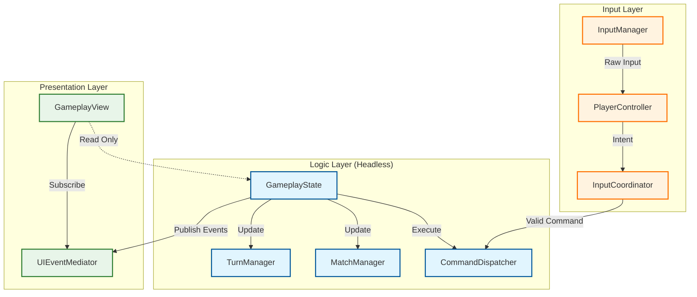
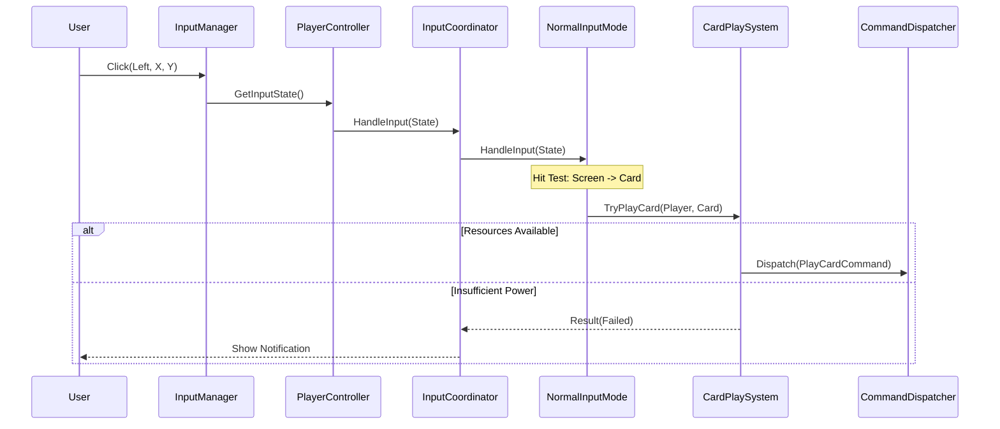
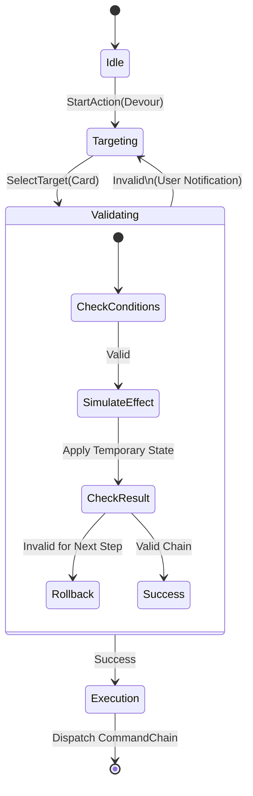
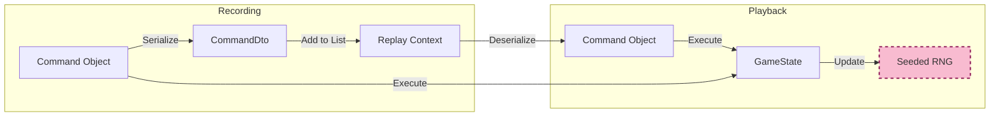
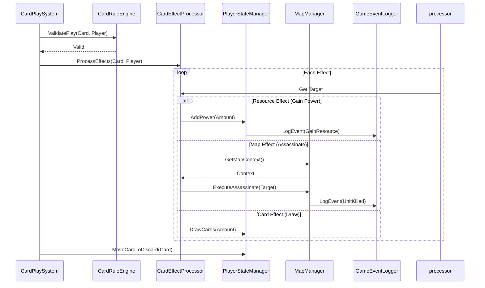
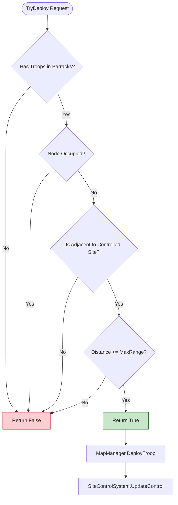
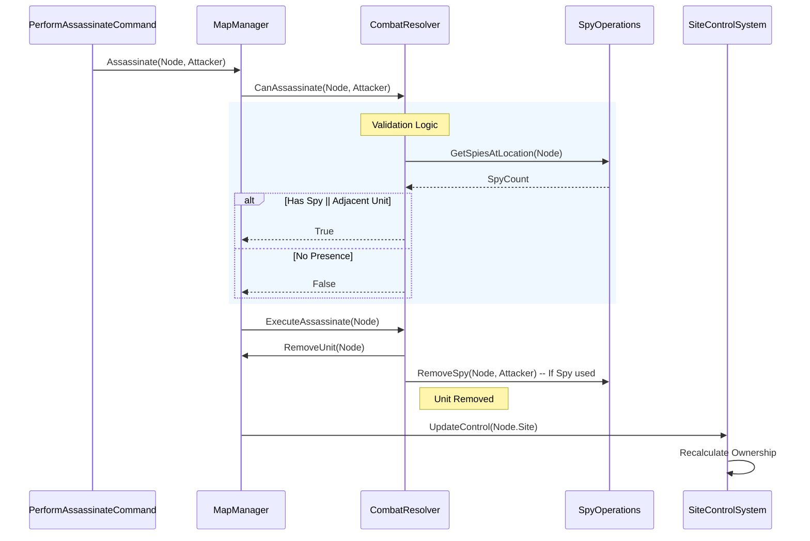

# Game Logic Flow Visualization

This document visualizes the data flow and component interactions within the ChaosWarlords engine.

## 1. High-Level Architecture

The engine strictly separates **Logic** (Game State) from **Presentation** (View).

---

## 2. Input Processing Pipeline

How a user click becomes a game action (e.g., Playing a Card).

---

## 3. Transactional Action Flow

Visualizing the "Lookahead" and atomic execution of complex actions (e.g., Devour -> Gain Resource).

---

## 4. Replay & Determinism System

How the game ensures every client sees the same result.

---

## 5. Detailed Systems Interaction

### 5.1 Card Effect Resolution
This sequence details how a card's effects are processed after it is played. This involves validation, target acquisition, and integration with resource managers.

### 5.2 Troop Deployment Validation
The `MapRuleEngine` ensures all deployments follow graph connectivity and occupancy rules.

### 5.3 Combat & Spy Operations (Assassination)
This flow shows the interaction between the `CombatResolver`, `SpyOperations`, and `MapManager` when resolving an assassination attempt.

