# Game Logic Flow Visualization

This document visualizes the data flow and component interactions within the ChaosWarlords engine, ordered from high-level concepts to detailed implementation flows.

## 1. High-Level Architecture
**Concept**: The 10,000ft view. How the Headless Logic interacts with the Input and View layers.

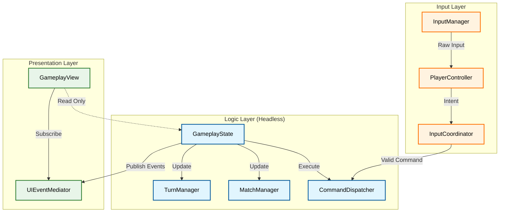
```mermaid
graph TD
    subgraph "Logic Layer (Headless)"
        GS[GameplayState] -->|Update| TM[TurnManager]
        GS -->|Update| MM[MatchManager]
        GS -->|Execute| CD[CommandDispatcher]
    end

    subgraph "Input Layer"
        IM[InputManager] -->|Raw Input| PC[PlayerController]
        PC -->|Intent| GIC[InputCoordinator]
        GIC -->|Valid Command| CD
    end

    subgraph "Presentation Layer"
        GV[GameplayView] -.->|Read Only| GS
        GV -->|Subscribe| UIM[UIEventMediator]
        GS -->|Publish Events| UIM
    end

    classDef logic fill:#e1f5fe,stroke:#01579b,stroke-width:2px,color:black;
    classDef input fill:#fff3e0,stroke:#ff6f00,stroke-width:2px,color:black;
    classDef view fill:#e8f5e9,stroke:#2e7d32,stroke-width:2px,color:black;

    class GS,TM,MM,CD logic;
    class IM,PC,GIC input;
    class GV,UIM view;
```

> **Key Takeaway**: The **Logic Layer** runs the game physics/rules and can run without a screen (Headless). The **Presentation Layer** just listens and draws. The **Input Layer** converts your mouse clicks into "Intents" which are validated before becoming Commands.

---

## 2. MatchContext Lifecycle
**Concept**: The foundation. How a match is initialized and what MatchContext provides to all game systems.

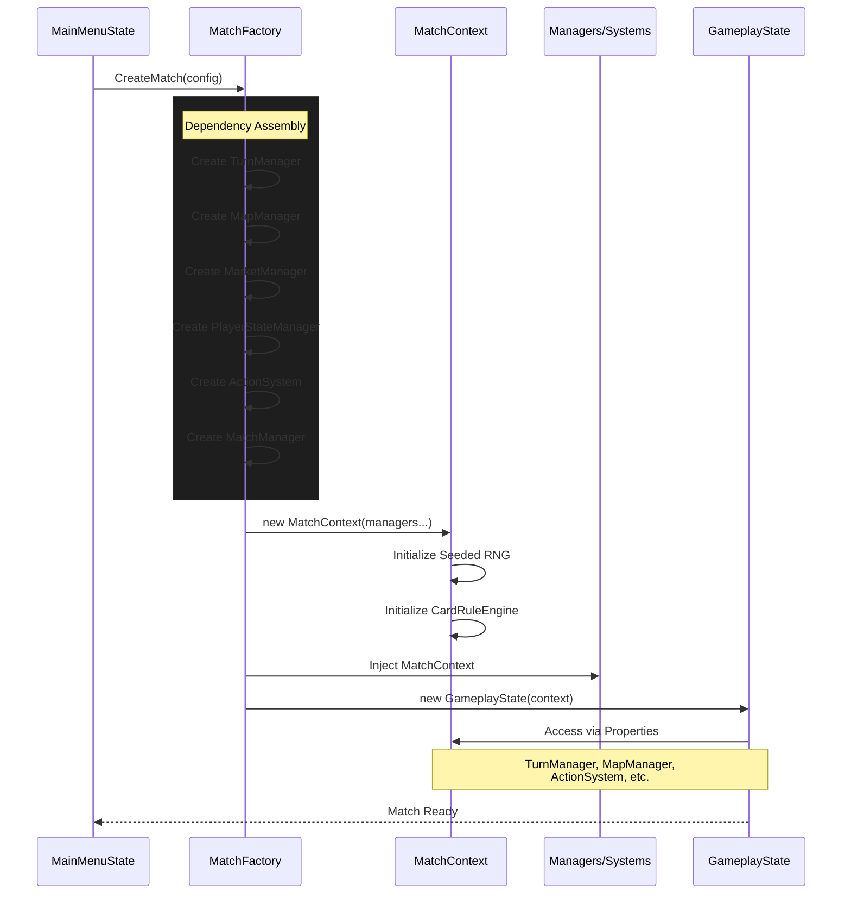
```mermaid
sequenceDiagram
    participant Menu as MainMenuState
    participant Factory as MatchFactory
    participant Context as MatchContext
    participant Managers as Managers/Systems
    participant Gameplay as GameplayState

    Menu->>Factory: CreateMatch(config)
    
    rect rgb(30, 30, 30)
        Note over Factory: Dependency Assembly
        Factory->>Factory: Create TurnManager
        Factory->>Factory: Create MapManager
        Factory->>Factory: Create MarketManager
        Factory->>Factory: Create PlayerStateManager
        Factory->>Factory: Create ActionSystem
        Factory->>Factory: Create MatchManager
    end
    
    Factory->>Context: new MatchContext(managers...)
    Context->>Context: Initialize Seeded RNG
    Context->>Context: Initialize CardRuleEngine
    
    Factory->>Managers: Inject MatchContext
    Factory->>Gameplay: new GameplayState(context)
    
    Gameplay->>Context: Access via Properties
    Note over Gameplay,Context: TurnManager, MapManager,<br/>ActionSystem, etc.
    
    Gameplay-->>Menu: Match Ready
```

> **Key Takeaway**: **MatchContext** is a scoped DI container created by `MatchFactory`. It holds all managers, systems, and game state for a single match. All game logic accesses dependencies through MatchContext, enabling headless execution and clean testing.

**MatchContext Contents:**
- **Managers**: `TurnManager`, `MapManager`, `MarketManager`, `MatchManager`, `PlayerStateManager`
- **Systems**: `ActionSystem`, `CardRuleEngine`
- **State**: `ActivePlayer`, `VoidPile`, `Random` (seeded RNG)
- **Separation**: Pure game logic, no UI dependencies

---

## 3. Data Lifecycles
**Concept**: Before understanding *how* things happen, understand *what* is being manipulated (Cards & Victory Points).

### 3.1 Card Lifecycle
A card's journey from the Market through a player's hand and eventually to their scoring pile.

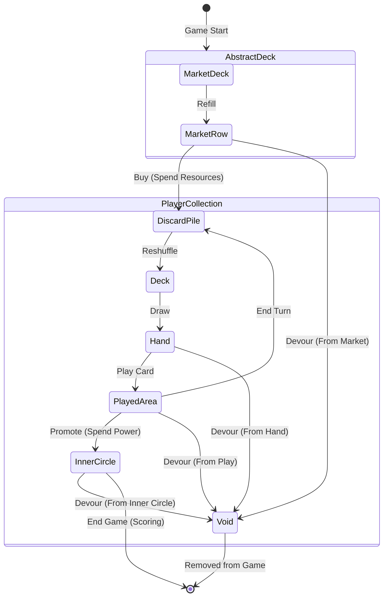
```mermaid
stateDiagram-v2
    classDef location fill:#f3e5f5,stroke:#4a148c,stroke-width:2px,color:black;
    classDef terminal fill:#eeeeee,stroke:#616161,stroke-width:2px,color:black,stroke-dasharray: 5 5;

    [*] --> AbstractDeck: Game Start
    
    state AbstractDeck {
        MarketDeck --> MarketRow: Refill
    }

    MarketRow --> DiscardPile: Buy (Spend Resources)
    MarketRow --> Void: Devour (From Market)
    
    state PlayerCollection {
        DiscardPile --> Deck: Reshuffle
        Deck --> Hand: Draw
        Hand --> PlayedArea: Play Card
        PlayedArea --> DiscardPile: End Turn
        
        PlayedArea --> InnerCircle: Promote (Spend Power)
        Hand --> Void: Devour (From Hand)
        PlayedArea --> Void: Devour (From Play)
        InnerCircle --> Void: Devour (From Inner Circle)
    }

    InnerCircle --> [*]: End Game (Scoring)
    Void --> [*]: Removed from Game

    class MarketDeck,MarketRow,DiscardPile,Deck,Hand,PlayedArea,InnerCircle location;
    class Void terminal;
```

> **Key Takeaway**: Cards flow from the **Market** to your **Hand**. When played, they go to your **Played Area**. At the end of the turn, they are **Discarded**. You can only **Promote** cards from the Played Area to your Inner Circle (Score Pile). Devouring a card removes it from the game permanently (Void).

### 3.2 Victory & Scoring Flows
The ultimate goal of the game: how the winner is decided.

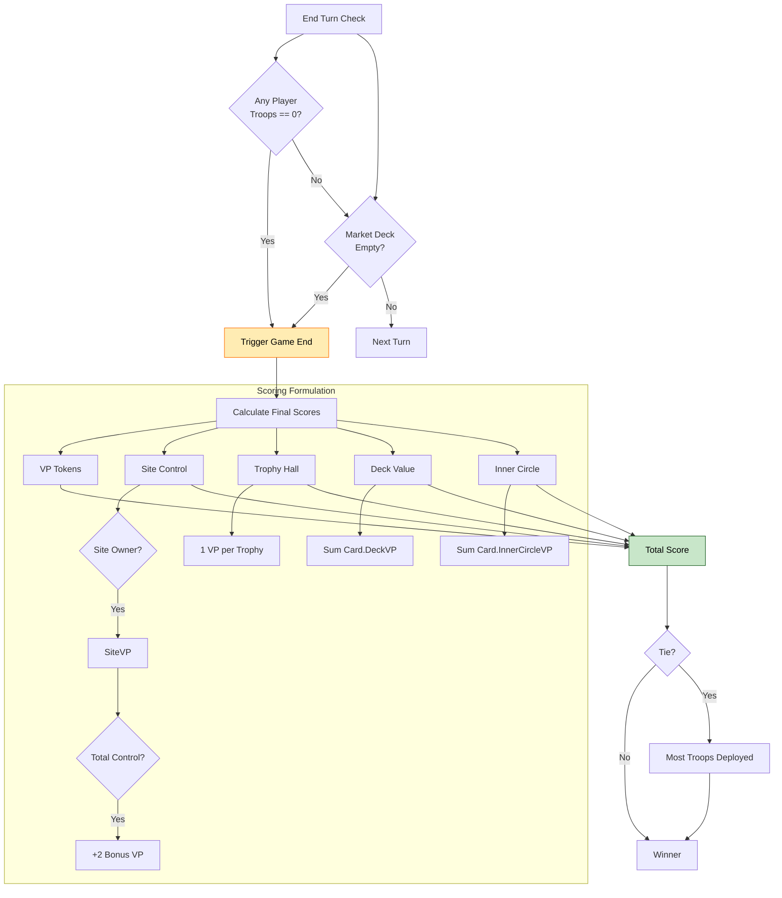
```mermaid
flowchart TD
    CheckEnd[End Turn Check] --> Condition1{Any Player\nTroops == 0?}
    CheckEnd --> Condition2{Market Deck\nEmpty?}
    
    Condition1 -- Yes --> TriggerEnd[Trigger Game End]
    Condition1 -- No --> Condition2
    Condition2 -- Yes --> TriggerEnd
    Condition2 -- No --> Continue[Next Turn]
    
    TriggerEnd --> CalcScore[Calculate Final Scores]
    
    subgraph Scoring Formulation
        CalcScore --> S1[VP Tokens]
        CalcScore --> S2[Site Control]
        CalcScore --> S3[Trophy Hall]
        S3 --> S3_1[1 VP per Trophy]
        
        CalcScore --> S4[Deck Value]
        S4 --> S4_1[Sum Card.DeckVP]
        
        CalcScore --> S5[Inner Circle]
        S5 --> S5_1[Sum Card.InnerCircleVP]
        
        S2 --> S2_Detail{Site Owner?}
        S2_Detail -- Yes --> SiteVP
        SiteVP --> TotalControl{Total Control?}
        TotalControl -- Yes --> Bonus[+2 Bonus VP]
    end
    
    S1 & S2 & S3 & S4 & S5 --> Total[Total Score]
    Total --> TieBreaker{Tie?}
    
    TieBreaker -- No --> Winner
    TieBreaker -- Yes --> TB1[Most Troops Deployed]
    TB1 --> Winner
    
    style TriggerEnd fill:#ffecb3,stroke:#ff6f00,color:black
    style Total fill:#c8e6c9,stroke:#1b5e20,color:black
```

> **Key Takeaway**: The game ends if the **Market Deck is empty** OR if **any player runs out of Troops**. Final score is a sum of direct VPs, Site Control (with bonuses), Trophies, Deck Value, and Inner Circle Value. **Ties** are broken by "Most Troops Deployed" (aggressive play wins ties).

---

## 4. Game State & Turn Lifecycle
**Concept**: The "Pulse" of the game. How the application moves between states and how a single turn is structured.

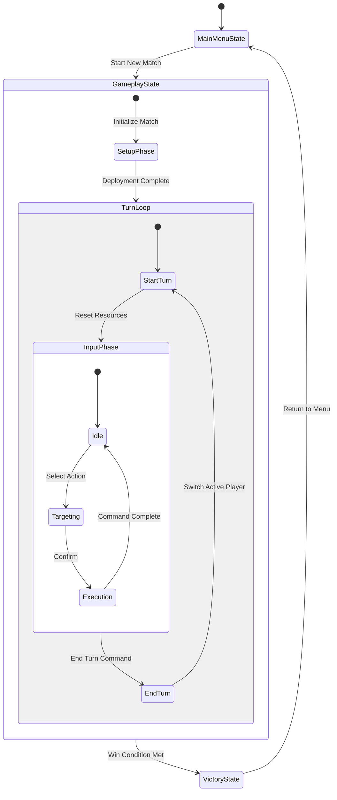
```mermaid
stateDiagram-v2
    classDef state fill:#e1f5fe,stroke:#01579b,stroke-width:2px,color:black;
    classDef substate fill:#fff3e0,stroke:#ff6f00,stroke-width:2px,color:black;

    [*] --> MainMenuState
    
    MainMenuState --> GameplayState: Start New Match
    
    state GameplayState {
        [*] --> SetupPhase: Initialize Match
        
        state TurnLoop {
            [*] --> StartTurn
            StartTurn --> InputPhase: Reset Resources
            
            state InputPhase {
                [*] --> Idle
                Idle --> Targeting: Select Action
                Targeting --> Execution: Confirm
                Execution --> Idle: Command Complete
            }
            
            InputPhase --> EndTurn: End Turn Command
            EndTurn --> StartTurn: Switch Active Player
        }
        
        SetupPhase --> TurnLoop: Deployment Complete
    }

    GameplayState --> VictoryState: Win Condition Met
    VictoryState --> MainMenuState: Return to Menu

    class MainMenuState,GameplayState,VictoryState state;
    class SetupPhase,TurnLoop,StartTurn,InputPhase,EndTurn substate;
```

> **Key Takeaway**: The game loops through **Turns**. In each turn, a player enters an **Input Phase** where they can perform multiple actions (Idle -> Target -> Execute) until they explicitly choose to **End Turn**. **Setup Phase** happens once at the start.

> **Key Takeaway**: The game loops through **Turns**. In each turn, a player enters an **Input Phase** where they can perform multiple actions (Idle -> Target -> Execute) until they explicitly choose to **End Turn**. **Setup Phase** happens once at the start.

---

## 5. Turn Phase Transitions
**Concept**: The detailed flow through a single turn, from start to cleanup.

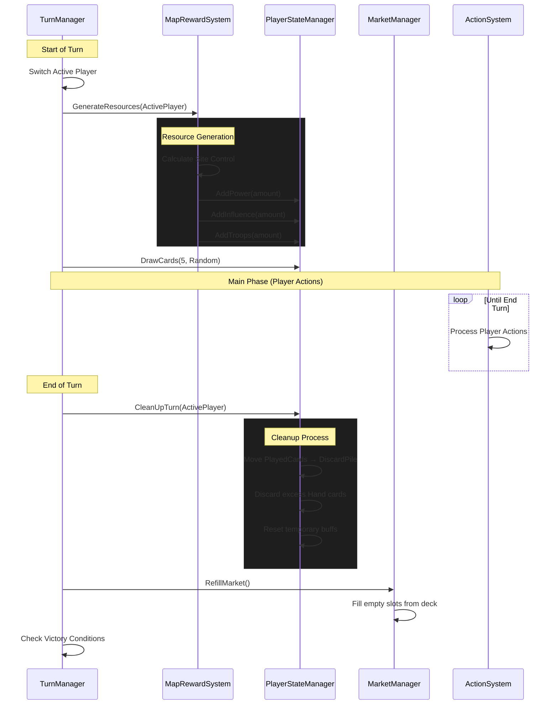
```mermaid
sequenceDiagram
    participant TM as TurnManager
    participant Reward as MapRewardSystem
    participant Player as PlayerStateManager
    participant Market as MarketManager
    participant Action as ActionSystem
    
    Note over TM: Start of Turn
    TM->>TM: Switch Active Player
    TM->>Reward: GenerateResources(ActivePlayer)
    
    rect rgb(30, 30, 30)
        Note over Reward: Resource Generation
        Reward->>Reward: Calculate Site Control
        Reward->>Player: AddPower(amount)
        Reward->>Player: AddInfluence(amount)
        Reward->>Player: AddTroops(amount)
    end
    
    TM->>Player: DrawCards(5, Random)
    
    Note over TM,Action: Main Phase (Player Actions)
    loop Until End Turn
        Action->>Action: Process Player Actions
    end
    
    Note over TM: End of Turn
    TM->>Player: CleanUpTurn(ActivePlayer)
    
    rect rgb(30, 30, 30)
        Note over Player: Cleanup Process
        Player->>Player: Move PlayedCards → DiscardPile
        Player->>Player: Discard excess Hand cards
        Player->>Player: Reset temporary buffs
    end
    
    TM->>Market: RefillMarket()
    Market->>Market: Fill empty slots from deck
    
    TM->>TM: Check Victory Conditions
```

> **Key Takeaway**: Each turn follows a strict sequence: **Generate Resources** → **Draw Cards** → **Main Phase** (player actions) → **Cleanup** → **Refill Market** → **Check Victory**. `TurnManager` orchestrates this flow, delegating to specialized managers.

---

## 6. Resource Generation Flow
**Concept**: How sites generate Power, Influence, and Troops at the start of each turn.

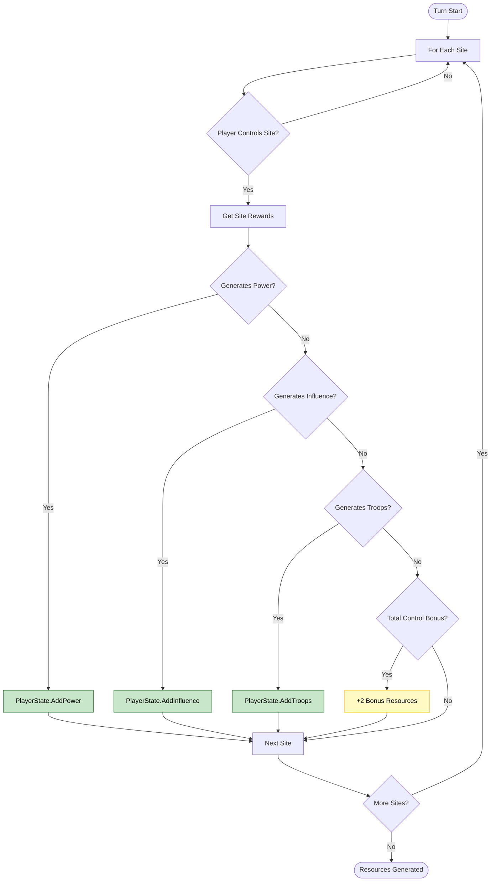
```mermaid
flowchart TD
    Start([Turn Start]) --> Iterate[For Each Site]
    Iterate --> CheckControl{Player Controls Site?}
    CheckControl -- No --> Iterate
    CheckControl -- Yes --> GetRewards[Get Site Rewards]
    
    GetRewards --> Power{Generates Power?}
    Power -- Yes --> AddPower[PlayerState.AddPower]
    Power -- No --> Influence
    
    Influence{Generates Influence?}
    Influence -- Yes --> AddInfluence[PlayerState.AddInfluence]
    Influence -- No --> Troops
    
    Troops{Generates Troops?}
    Troops -- Yes --> AddTroops[PlayerState.AddTroops]
    Troops -- No --> CheckBonus
    
    CheckBonus{Total Control Bonus?}
    CheckBonus -- Yes --> BonusReward[+2 Bonus Resources]
    CheckBonus -- No --> NextSite
    
    BonusReward --> NextSite[Next Site]
    AddPower --> NextSite
    AddInfluence --> NextSite
    AddTroops --> NextSite
    NextSite --> MoreSites{More Sites?}
    MoreSites -- Yes --> Iterate
    MoreSites -- No --> Done([Resources Generated])
    
    style AddPower fill:#c8e6c9,stroke:#1b5e20,color:black
    style AddInfluence fill:#c8e6c9,stroke:#1b5e20,color:black
    style AddTroops fill:#c8e6c9,stroke:#1b5e20,color:black
    style BonusReward fill:#fff9c4,stroke:#fbc02d,color:black
```

> **Key Takeaway**: `MapRewardSystem` iterates through all sites, checking ownership. Controlled sites grant their resources (Power/Influence/Troops) to the controlling player. **Total Control** of all sites in a region grants bonus resources.

---

## 7. Market Operations
**Concept**: How the market refills and how players acquire cards.

### 7.1 Market Refill Flow

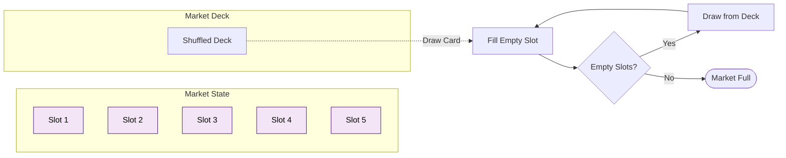
```mermaid
flowchart LR
    subgraph Market State
        Slot1[Slot 1]
        Slot2[Slot 2]
        Slot3[Slot 3]
        Slot4[Slot 4]
        Slot5[Slot 5]
    end
    
    subgraph Market Deck
        Deck[Shuffled Deck]
    end
    
    Check{Empty Slots?} --> |Yes| Draw[Draw from Deck]
    Check --> |No| Done([Market Full])
    Draw --> Fill[Fill Empty Slot]
    Fill --> Check
    
    Deck -.->|Draw Card| Fill
    
    style Slot1 fill:#f3e5f5,stroke:#4a148c,color:black
    style Slot2 fill:#f3e5f5,stroke:#4a148c,color:black
    style Slot3 fill:#f3e5f5,stroke:#4a148c,color:black
    style Slot4 fill:#f3e5f5,stroke:#4a148c,color:black
    style Slot5 fill:#f3e5f5,stroke:#4a148c,color:black
```

### 7.2 Card Acquisition Flow

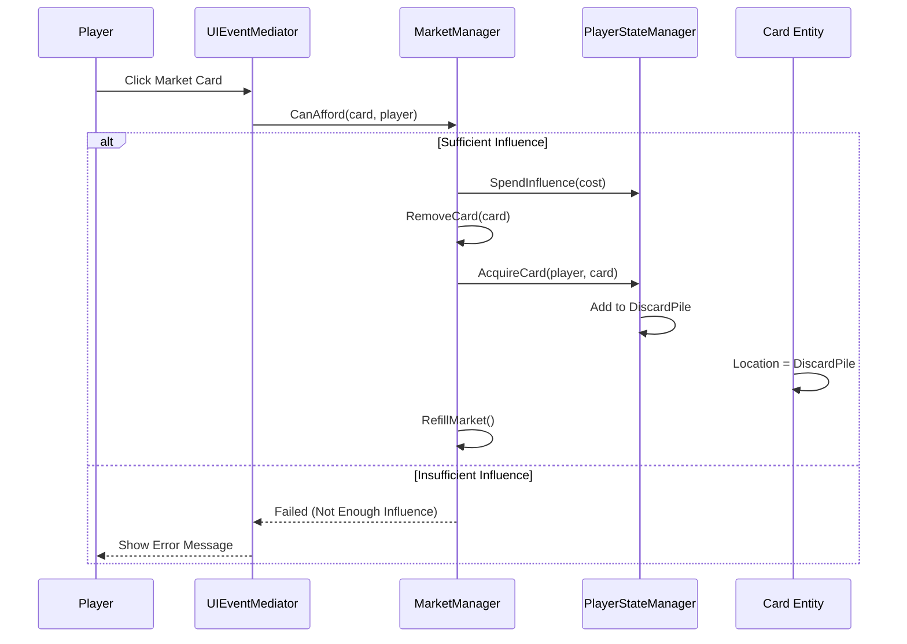
```mermaid
sequenceDiagram
    participant Player
    participant UI as UIEventMediator
    participant Market as MarketManager
    participant PlayerState as PlayerStateManager
    participant Card as Card Entity
    
    Player->>UI: Click Market Card
    UI->>Market: CanAfford(card, player)
    
    alt Sufficient Influence
        Market->>PlayerState: SpendInfluence(cost)
        Market->>Market: RemoveCard(card)
        Market->>PlayerState: AcquireCard(player, card)
        PlayerState->>PlayerState: Add to DiscardPile
        Card->>Card: Location = DiscardPile
        Market->>Market: RefillMarket()
    else Insufficient Influence
        Market-->>UI: Failed (Not Enough Influence)
        UI-->>Player: Show Error Message
    end
```

> **Key Takeaway**: The market maintains 5 slots, refilling from the deck when cards are purchased or devoured. Cards are acquired to the **DiscardPile** (not Hand), ensuring they enter the player's deck cycle. The market refills immediately after acquisition.

---

## 8. Input Processing Pipeline
**Concept**: How a user interacts with the running loop. From "Click" to "Command".

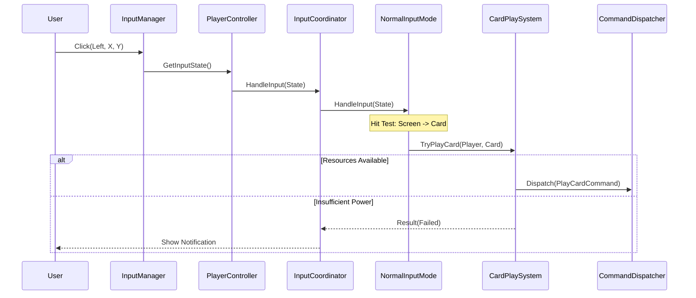
```mermaid
sequenceDiagram
    participant User
    participant InputManager as InputManager
    participant Controller as PlayerController
    participant Coordinator as InputCoordinator
    participant Mode as NormalInputMode
    participant System as CardPlaySystem
    participant Command as CommandDispatcher

    User->>InputManager: Click(Left, X, Y)
    InputManager->>Controller: GetInputState()
    Controller->>Coordinator: HandleInput(State)
    Coordinator->>Mode: HandleInput(State)
    
    Note over Mode: Hit Test: Screen -> Card
    
    Mode->>System: TryPlayCard(Player, Card)
    
    alt Resources Available
        System->>Command: Dispatch(PlayCardCommand)
    else Insufficient Power
        System-->>Coordinator: Result(Failed)
        Coordinator-->>User: Show Notification
    end
```

> **Key Takeaway**: Inputs are filtered three times: 
> 1. **InputManager**: "Did they click?" 
> 2. **Coordinator**: "Is this a valid UI state?"
> 3. **InputMode**: "Is the target valid?" 
> Only then is a **Command** dispatched.

---

## 9. Event System Flow
**Concept**: How components communicate without tight coupling using the Pub/Sub pattern.

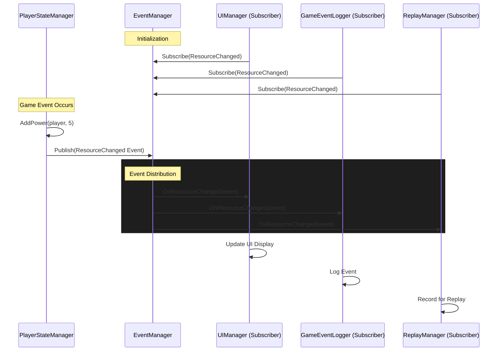
```mermaid
sequenceDiagram
    participant Publisher as PlayerStateManager
    participant EventMgr as EventManager
    participant Sub1 as UIManager (Subscriber)
    participant Sub2 as GameEventLogger (Subscriber)
    participant Sub3 as ReplayManager (Subscriber)
    
    Note over EventMgr: Initialization
    Sub1->>EventMgr: Subscribe(ResourceChanged)
    Sub2->>EventMgr: Subscribe(ResourceChanged)
    Sub3->>EventMgr: Subscribe(ResourceChanged)
    
    Note over Publisher: Game Event Occurs
    Publisher->>Publisher: AddPower(player, 5)
    Publisher->>EventMgr: Publish(ResourceChanged Event)
    
    rect rgb(30, 30, 30)
        Note over EventMgr: Event Distribution
        EventMgr->>Sub1: OnResourceChanged(event)
        EventMgr->>Sub2: OnResourceChanged(event)
        EventMgr->>Sub3: OnResourceChanged(event)
    end
    
    Sub1->>Sub1: Update UI Display
    Sub2->>Sub2: Log Event
    Sub3->>Sub3: Record for Replay
```

> **Key Takeaway**: `EventManager` implements Pub/Sub to decouple components. Publishers (like `PlayerStateManager`) emit events without knowing who's listening. Subscribers (like `UIManager`, `GameEventLogger`) react independently. This enables features like replay recording and UI updates without modifying game logic.

---

## 10. UI Event Mediation
**Concept**: How UI button clicks trigger game logic without creating tight coupling between View and Logic layers.

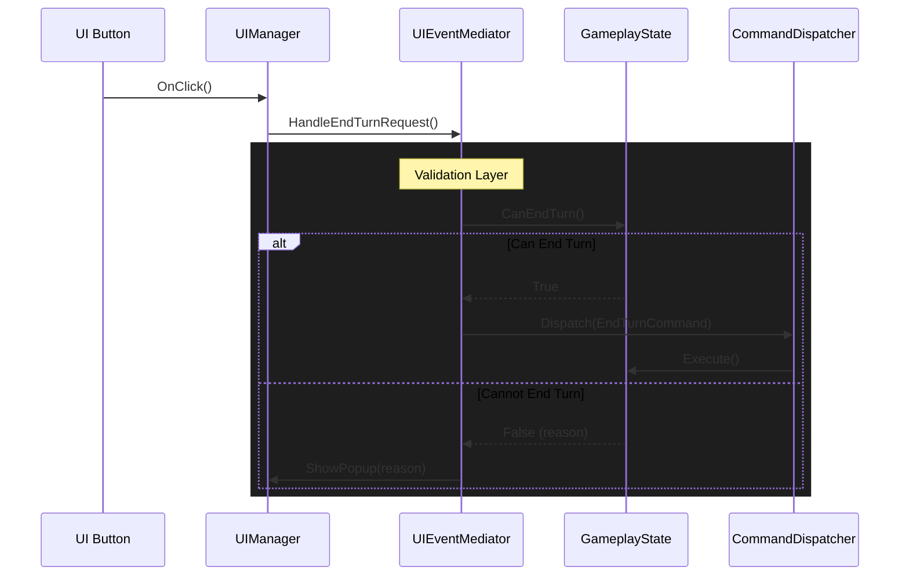
```mermaid
sequenceDiagram
    participant Button as UI Button
    participant UIManager as UIManager
    participant Mediator as UIEventMediator
    participant GameState as GameplayState
    participant Command as CommandDispatcher
    
    Button->>UIManager: OnClick()
    UIManager->>Mediator: HandleEndTurnRequest()
    
    rect rgb(30, 30, 30)
        Note over Mediator: Validation Layer
        Mediator->>GameState: CanEndTurn()
        
        alt Can End Turn
            GameState-->>Mediator: True
            Mediator->>Command: Dispatch(EndTurnCommand)
            Command->>GameState: Execute()
        else Cannot End Turn
            GameState-->>Mediator: False (reason)
            Mediator->>UIManager: ShowPopup(reason)
        end
    end
```

> **Key Takeaway**: `UIEventMediator` sits between the UI layer and game logic, translating UI events into validated commands. This prevents the View from directly calling game logic, maintaining the separation needed for headless execution. The mediator validates state before dispatching commands.

**Key Responsibilities:**
- Validate UI actions against game state
- Translate UI events → Commands
- Handle confirmation popups
- Manage market open/close state
- Coordinate input mode transitions

---

## 11. Detailed Systems Interaction
**Concept**: The specific mechanics that run when a command is executed.

### 11.1 Card Effect Resolution
This sequence details how a card's effects are processed after it is played.

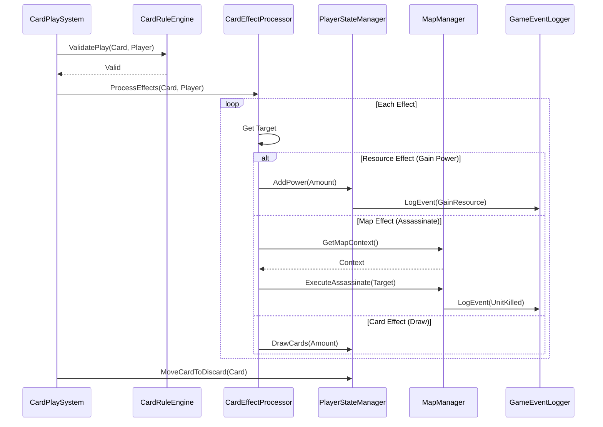
```mermaid
sequenceDiagram
    participant PlaySys as CardPlaySystem
    participant RuleEng as CardRuleEngine
    participant Processor as CardEffectProcessor
    participant PlayerState as PlayerStateManager
    participant MapMgr as MapManager
    participant Log as GameEventLogger

    PlaySys->>RuleEng: ValidatePlay(Card, Player)
    RuleEng-->>PlaySys: Valid
    PlaySys->>Processor: ProcessEffects(Card, Player)
    
    loop Each Effect
        Processor->>Processor: Get Target
        
        alt Resource Effect (Gain Power)
            Processor->>PlayerState: AddPower(Amount)
            PlayerState->>Log: LogEvent(GainResource)
        else Map Effect (Assassinate)
            Processor->>MapMgr: GetMapContext()
            MapMgr-->>Processor: Context
            Processor->>MapMgr: ExecuteAssassinate(Target)
            MapMgr->>Log: LogEvent(UnitKilled)
        else Card Effect (Draw)
            Processor->>PlayerState: DrawCards(Amount)
        end
    end
    
    PlaySys->>PlayerState: MoveCardToDiscard(Card)
```

> **Key Takeaway**: Playing a card triggers a chain of events. The **CardRuleEngine** first validates the play. Then, the **Processor** iterates through every effect on the card. Each effect (Resource, Map, Draw) is handled by a specific Manager.

### 11.2 Troop Deployment Validation
The `MapRuleEngine` ensures all deployments follow graph connectivity and occupancy rules.

```mermaid
flowchart TD
    Start([TryDeploy Request]) --> HasTroops{Has Troops in Barracks?}
    HasTroops -- No --> Fail[Return False]
    HasTroops -- Yes --> IsOccupied{Node Occupied?}
    
    IsOccupied -- Yes --> Fail
    IsOccupied -- No --> CheckAdjacency{Is Adjacent to Controlled Site?}
    
    CheckAdjacency -- No --> Fail
    CheckAdjacency -- Yes --> CheckDistance{Distance <= MaxRange?}
    
    CheckDistance -- No --> Fail
    CheckDistance -- Yes --> Success[Return True]
    
    Success --> UpdateMap[MapManager.DeployTroop]
    UpdateMap --> UpdateSite[SiteControlSystem.UpdateControl]
    
    style Fail fill:#ffcdd2,stroke:#ba000d,color:black
    style Success fill:#c8e6c9,stroke:#1b5e20,color:black
```

> **Key Takeaway**: You can't just put troops anywhere. The **MapRuleEngine** enforces specific rules: You must have troops available, the node must be empty, it must be adjacent to your site, AND within range. All checks must pass.

### 11.3 Combat & Spy Operations (Assassination)
This flow shows the interaction between the Command, MapManager, and CombatResolver.

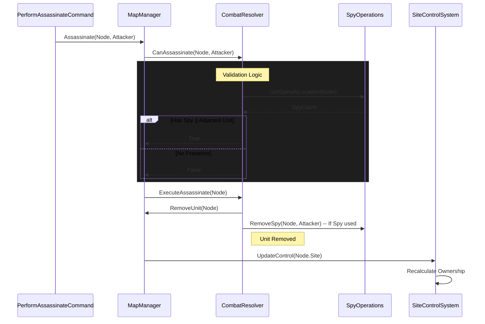
```mermaid
sequenceDiagram
    participant Command as PerformAssassinateCommand
    participant MapMgr as MapManager
    participant Combat as CombatResolver
    participant SpyOps as SpyOperations
    participant SiteSys as SiteControlSystem

    Command->>MapMgr: Assassinate(Node, Attacker)
    MapMgr->>Combat: CanAssassinate(Node, Attacker)
    
    rect rgb(30, 30, 30)
        Note over Combat: Validation Logic
        Combat->>SpyOps: GetSpiesAtLocation(Node)
        SpyOps-->>Combat: SpyCount
        
        alt Has Spy || Adjacent Unit
            Combat-->>MapMgr: True
        else No Presence
            Combat-->>MapMgr: False
        end
    end

    MapMgr->>Combat: ExecuteAssassinate(Node)
    Combat->>MapMgr: RemoveUnit(Node)
    Combat->>SpyOps: RemoveSpy(Node, Attacker) -- If Spy used
    
    Note right of Combat: Unit Removed
    
    MapMgr->>SiteSys: UpdateControl(Node.Site)
    SiteSys->>SiteSys: Recalculate Ownership
```

> **Key Takeaway**: Assassination is complex. It checks for Spies and adjacent units. If a Spy is present at the target location, it can enable the kill! **SpyOperations** handles this check essentially acting as a "buff" to your assassination attempt.

---

### 11.4 Action Delegation (Subsystems & Helpers)
The `ActionSystem` acts as a coordinator, delegating specific complex mechanics to dedicated subsystems and helper classes to maintain low cyclomatic complexity.

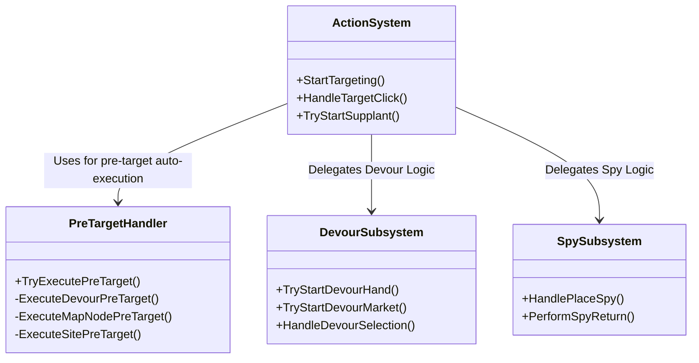
```mermaid
classDiagram
    class ActionSystem {
        +StartTargeting()
        +HandleTargetClick()
        +TryStartSupplant()
    }
    class PreTargetHandler {
        +TryExecutePreTarget()
        -ExecuteDevourPreTarget()
        -ExecuteMapNodePreTarget()
        -ExecuteSitePreTarget()
    }
    class DevourSubsystem {
        +TryStartDevourHand()
        +TryStartDevourMarket()
        +HandleDevourSelection()
    }
    class SpySubsystem {
        +HandlePlaceSpy()
        +PerformSpyReturn()
    }

    ActionSystem --> PreTargetHandler : Uses for pre-target auto-execution
    ActionSystem --> DevourSubsystem : Delegates Devour Logic
    ActionSystem --> SpySubsystem : Delegates Spy Logic
```

> **Key Takeaway**: To keep complexity low (CC ≤ 10), `ActionSystem` delegates to specialized helpers:
> - **PreTargetHandler** - Handles pre-selected target execution (extracted to reduce CC 26→6)
> - **DevourSubsystem** - Manages devour mechanics
> - **SpySubsystem** - Handles spy placement and removal

---

### 11.5 Card Effect Processing (Strategy Pattern)
The `CardEffectProcessor` uses the Strategy Pattern for devour operations to eliminate conditional complexity.

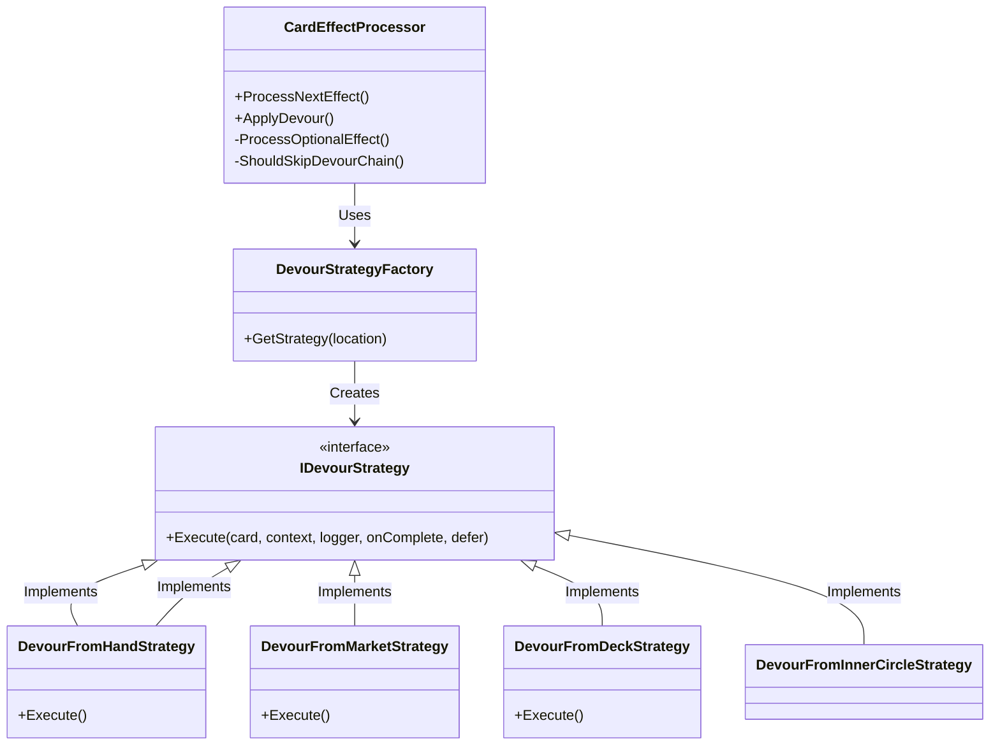
```mermaid
classDiagram
    class CardEffectProcessor {
        +ProcessNextEffect()
        +ApplyDevour()
        -ProcessOptionalEffect()
        -ShouldSkipDevourChain()
    }
    class DevourStrategyFactory {
        +GetStrategy(location)
    }
    class IDevourStrategy {
        <<interface>>
        +Execute(card, context, logger, onComplete, defer)
    }
    class DevourFromHandStrategy {
        +Execute()
    }
    class DevourFromMarketStrategy {
        +Execute()
    }
    class DevourFromDeckStrategy {
        +Execute()
    }

    CardEffectProcessor --> DevourStrategyFactory : Uses
    DevourStrategyFactory --> IDevourStrategy : Creates
    IDevourStrategy <|-- DevourFromHandStrategy : Implements
    IDevourStrategy <|-- DevourFromHandStrategy : Implements
    IDevourStrategy <|-- DevourFromMarketStrategy : Implements
    IDevourStrategy <|-- DevourFromDeckStrategy : Implements
    IDevourStrategy <|-- DevourFromInnerCircleStrategy : Implements
```

> **Key Takeaway**: Instead of nested conditionals checking `CardLocation`, the processor uses a **Strategy Pattern**. This reduced `ApplyDevour` complexity from CC 16→6 and makes adding new devour locations trivial.

---

## 12. Transactional Action Flow (ActionSystem)
**Concept**: Advanced Topic. How complex, multi-step actions (like Devour) are orchestrated between the Coordinator and Subsystems.

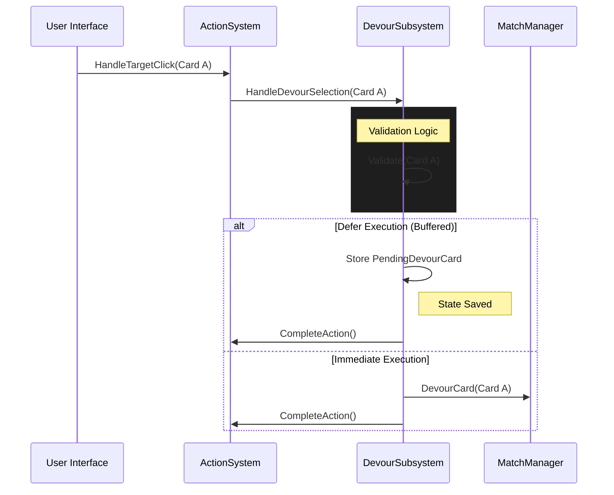
```mermaid
sequenceDiagram
    participant UI as User Interface
    participant AS as ActionSystem
    participant SUB as DevourSubsystem
    participant MM as MatchManager

    UI->>AS: HandleTargetClick(Card A)
    AS->>SUB: HandleDevourSelection(Card A)
    
    rect rgb(30, 30, 30)
        Note over SUB: Validation Logic
        SUB->>SUB: Validate(Card A)
    end
    
    alt Defer Execution (Buffered)
        SUB->>SUB: Store PendingDevourCard
        Note right of SUB: State Saved
        SUB->>AS: CompleteAction()
    else Immediate Execution
        SUB->>MM: DevourCard(Card A)
        SUB->>AS: CompleteAction()
    end
```

> **Key Takeaway**: For multi-step actions, the **ActionSystem** receives the input but passes it to the **Subsystem**. The Subsystem decides whether to execute immediately (commit) or buffer the data (validating state) for the next step in the transaction.

---

## 13. Serialization & Replay System
**Concept**: Infrastructure. How the system ensures consistency across network/save-loads by converting "Live Objects" into "Data Transfer Objects" (DTOs).

### 13.1 DTO Mapping Strategy
The bridge between complex Runtime Entities and simple Serializable Data.

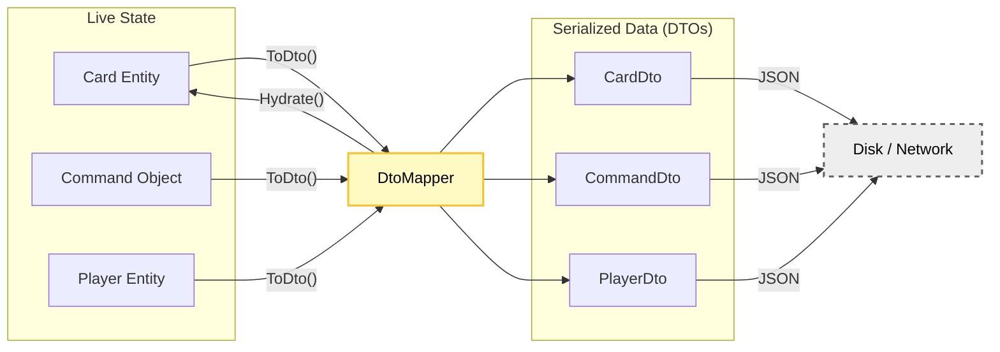
```mermaid
flowchart LR
    subgraph Live State
        E1[Card Entity]
        E2[Command Object]
        E3[Player Entity]
    end

    Mapper[DtoMapper]

    subgraph "Serialized Data (DTOs)"
        D1[CardDto]
        D2[CommandDto]
        D3[PlayerDto]
    end
    
    E1 & E2 & E3 -->|"ToDto()"| Mapper
    Mapper -->|"Hydrate()"| E1
    
    Mapper --> D1 & D2 & D3
    D1 & D2 & D3 -->|JSON| Storage[Disk / Network]
    
    style Mapper fill:#fff9c4,stroke:#fbc02d,stroke-width:2px,color:black
    style Storage fill:#eeeeee,stroke:#616161,stroke-width:2px,stroke-dasharray: 5 5,color:black
```

> **Key Takeaway**: **DtoMapper** is the translator. It takes complex game objects like `Player` (with logic methods) and turns them into dumb data `PlayerDto` (just numbers and strings) that can be saved to a file or sent over the internet.

### 13.2 Replay Loop
How the game ensures every client sees the same result by re-executing serialized commands.

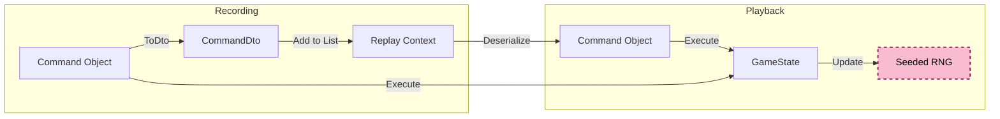
```mermaid
flowchart LR
    subgraph Recording
        CMD[Command Object] -->|ToDto| DTO[CommandDto]
        DTO -->|Add to List| REPLAY[Replay Context]
    end

    subgraph Playback
        REPLAY -->|Deserialize| CMD_NEW[Command Object]
        CMD_NEW -->|Execute| STATE[GameState]
        STATE -->|Update| RNG[Seeded RNG]
    end
    
    CMD -->|Execute| STATE
    
    style RNG fill:#f8bbd0,stroke:#880e4f,stroke-width:2px,stroke-dasharray: 5 5,color:black
```

> **Key Takeaway**: To show a replay, we don't record video. We just record the **List of Commands** (as DTOs). To "play" it back, we just feed those commands into the game engine one by one. The **Seeded RNG** ensures that all "random" events happen in the exact same way every time.

---

## Summary

This document visualizes the complete game logic flow from high-level architecture to detailed implementation. The flows demonstrate:
- Clear separation between Logic, Input, and Presentation layers
- Deterministic execution via Command Pattern and Seeded RNG
- Complex mechanics handled by specialized subsystems
- Transactional action processing with deferred execution

For implementation details, see [architecture.md](architecture.md). For test coverage, see [testing.md](testing.md).
